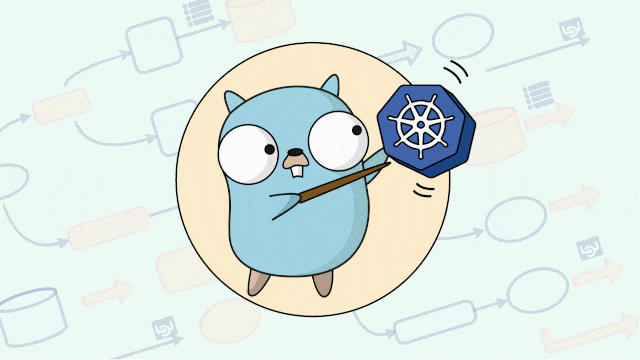
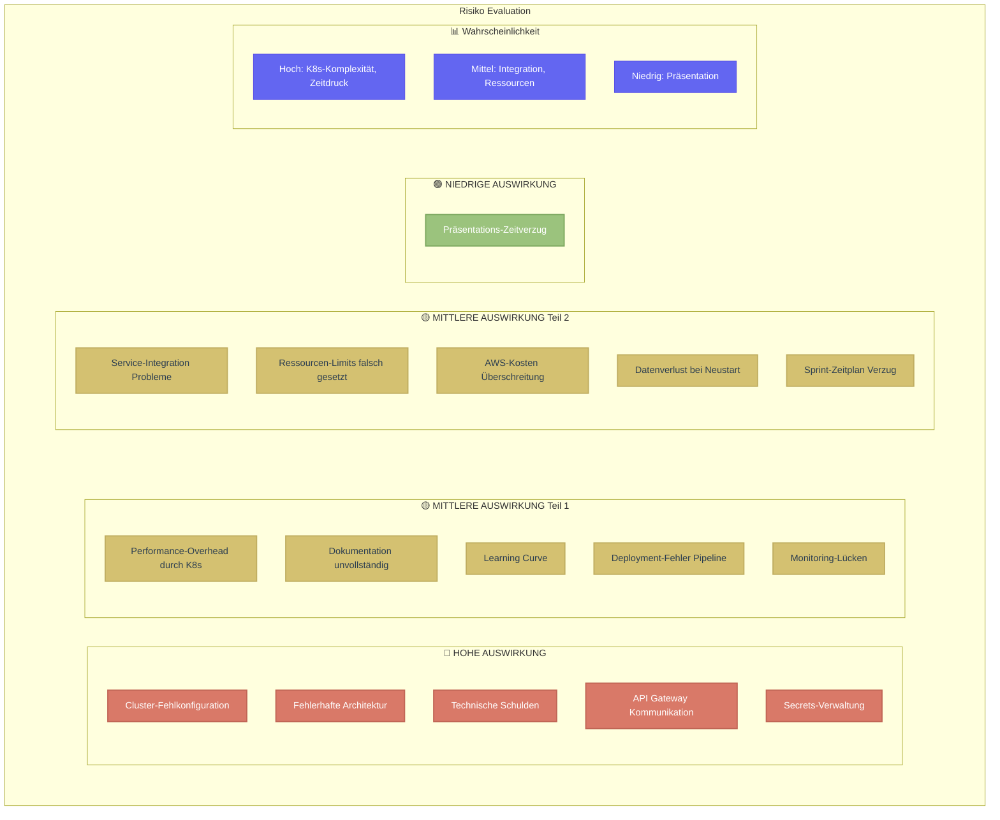
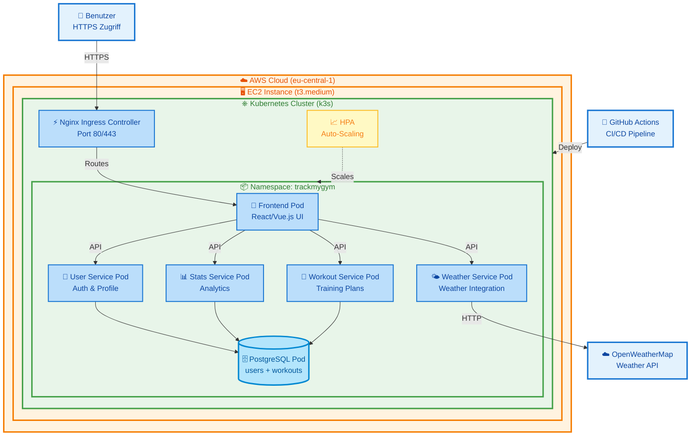
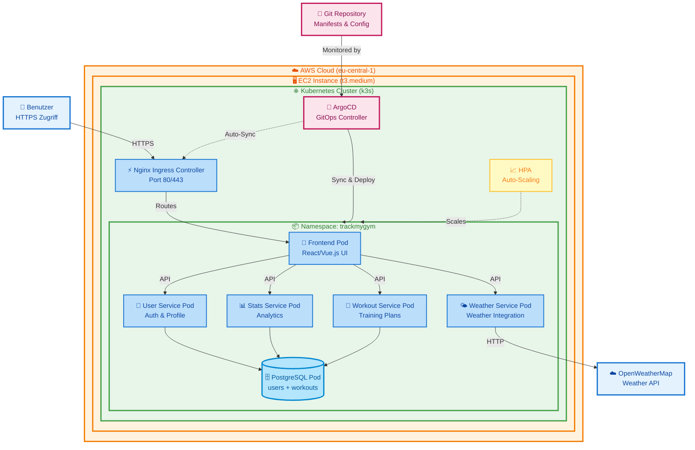
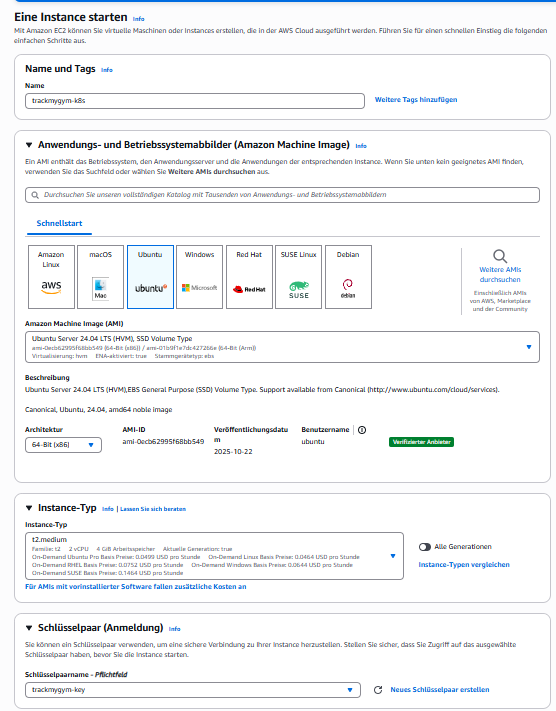
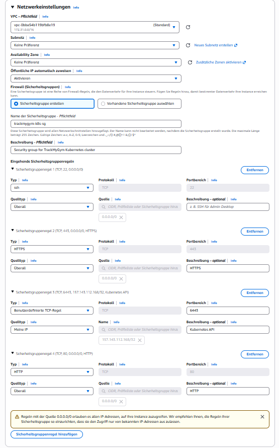
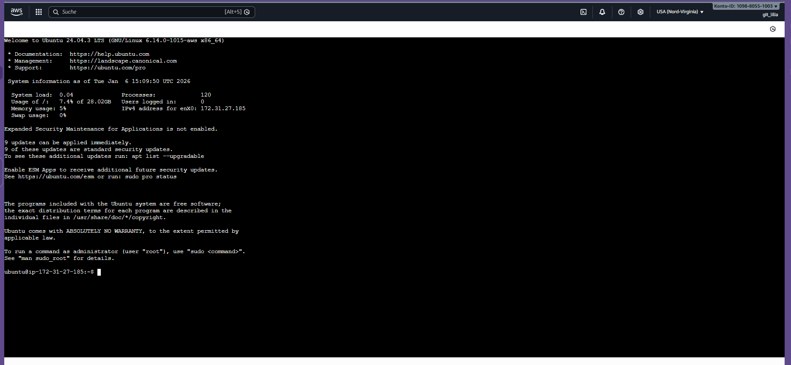
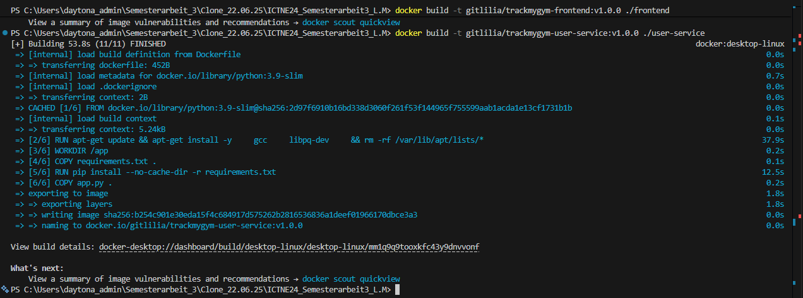

# README

# 🏋️‍♀️ FitTracker Pro - Kubernetes Version. Tracke. Wachse. Gewinne.


### Fitness Tracking Platform - Migriert auf Kubernetes


---

**Studierende:** Lilia Mechani | **Semester:** 4 | **Dozenten:** (PRJ) Corrado Parisi (CNC) Philip Stark.

[🚀 Live Demo](http://52.202.224.208/) • [📖 Repo](https://github.com/gitlilia-tbz/ICTNE24_Semesterarbeit3_L.M) • [🏗️ KanBan](https://semesterarbeit3liliam.atlassian.net/jira/software/projects/KAN/boards/1)

# Live Update:
|ArgoCD Setup: In Progress /// Aktualisierung Jira-Board: In Progress|

## Inhaltsverzeichnis

## 📋 Projektübersicht

### [1. 📊 Projektmanagement](#1--projektmanagement)

* [1.1 Projektbeschreibung](#11-projektbeschreibung)
* [1.2 Zeitplan](#12-zeitplan)
* [1.3 Risiko-Evaluation](#13-risiko-evaluation)
* [1.4 Risiko-Matrix](#14-risiko-matrix)
* [1.5 SWOT-Analyse](#15-swot-analyse)
* [1.6 Sprint-Dokumentation](#16-sprint-dokumentation)
  * [1.6.1 Sprint 1](#161-sprint-1)
  * [1.6.2 Sprint 2](#162-sprint-2)
  * [1.6.3 Sprint 3](#163-sprint-3)

* [1.7 Projekt Gantt-Diagramm](#18-projekt-gantt-diagramm)

### [2. 🛠️ Technische Dokumentation](#2-️-technische-dokumentation)

* [2.1 Architektur-Übersicht](#21-architektur-übersicht)

### [3. ☁️ Deployment](#3-️-deployment--devops)

* [3.1 AWS EC2 Setup](#31-aws-ec2-setup)
* [3.2 Kubernetes Setup](#32-kubernetes-setup)
* [3.3 ArgoCD](#33-ArgoCD)
* [3.4 YAML Files](#34-yaml-files)
* [3.5 Produktionsumgebung](#35-produktionsumgebung)

### [4. 📱 User Interface](#4--user-interface)

* [4.1 Frontend Design](#41-frontend-design)
* [4.2 User Experience](#42-user-experience)

### [5. 🧪 Testing & Qualitätssicherung](#5--testing--qualitätssicherung)

* [5.1 User-Testing](#52-user-testing)
* [5.2  10 Testfälle](#53-10-testfälle)

### [6. 📈 Ergebnisse & Reflexion](#6--ergebnisse--reflexion)

* [6.1 Erreichte Ziele](#61-erreichte-ziele)
* [6.2 Herausforderungen](#62-herausforderungen)
* [6.3 Lessons Learned](#63-lessons-learned)
* [6.4 Ausblick](#64-ausblick)

### [7. 📚 Anhang](#7--anhang)

* [7.1 Code-Repository](#71-code-repository)
* [7.2 Verwendete Technologien](#72-verwendete-technologien)
* [7.3 Quellen](#73-quellen)
* [7.4 Glossar](#74-glossar)
* [7.5 Kontaktangaben](#75-kontaktangaben)

---

# 1. 📊 Projektmanagement

## 1.1 Projektbeschreibung

Meine Microservices aus meiner letzten Semesterarbeit «TrackMyGym, Fitness Tracker PRO» werden nun in eine skalierbare Kubernetes-Umgebung übertragen. Weiterhin Cloud-Basiert und mit DevOps Pipelines deployable.
Zielsetzung der Semesterarbeit
Welche, z.B. als Aufstellung, Ziele sollen mit der Semesterarbeit erreicht werden.
Es sollten mindestens drei messbare Ziele aufgeführt werden.
1.  Die TrackMyGym Applikation bekommt ein neues Kleid. Die Microservices werden ins Kubernetes übertragen
2. Die Microservices werden innerhalb eines Skalierbaren Kubernetes Cluster betrieben. Diese wird in einer AWS EC2 Instanz gehostet. Bei erhöhter last, werden mehr Kubernetes Pods hochgefahren.
3. Eine CI/CD Pipeline wird innerhalb von GitHub Actions erstellt damit ein erfolgreiches Deployment des Images sowie Änderungen in der Code-Base nach Kubernetes erfolgen.


Die App soll auf folgenden Technologien basieren:

Werkzeuge:
-	Kubernetes -> Skalierbarkeit
-	GitHub -> Repo und Versionierung
-	Docker -> Image
-	VSCode + GitHub Add-in -> Source Code Editor und Dokumentation
-	Claude AI und Claude Code -> KI Unterstützte Entwicklung
-	Laptop -> Meine eigene Workstation

Durch die Migration zu Kubernetes wird die Applikation noch hochverfügbarer und somit Zukunftssicherer für eine breitere User-Adoption.

| :checkered_flag: Angezielte Kernfunktionen der neuen Infrastruktur                              |
| ------------------------------------------------------------------------------------------- |
| Folgende Ziele wurden gesetzt: |

1.  Die TrackMyGym Applikation bekommt ein neues Kleid. Die Microservices werden ins Kubernetes übertragen
2. Die Microservices werden innerhalb eines Skalierbaren Kubernetes Cluster betrieben. Diese wird in einer AWS EC2 Instanz gehostet. Bei erhöhter last, werden mehr Kubernetes Pods hochgefahren.
3. Eine CI/CD Pipeline wird innerhalb von GitHub Actions erstellt damit ein erfolgreiches Deployment des Images sowie Änderungen in der Code-Base nach Kubernetes erfolgen.


## 1.2 Zeitplan

Projektzeitleiste und Meilensteine
 


## 1.3 Risiko-Evaluation
Identifizierte Projektrisiken und deren Bewertung.



## 1.4 Risiko-Matrix
Übersicht der Risiken nach Wahrscheinlichkeit und Auswirkung.


## 1.5 SWOT-Analyse 
Stärken, Schwächen, Chancen und Risiken des Projektes innerhalb der SWOT Analyse.


## 1.6 Sprint-Dokumentation
### 1.6.1 Sprint 1
#### **Zeitraum**

27.10.25 - 17.11.25

---

#### **Sprintziele**

	Repo Setup, Projektkonzipierung, Technisches Design

---


#### **User Stories mit Akzeptanzkriterien**
---

📍​**User Story 1:**


| Title:                   | Priority: | Estimate: |
| -------------------------- | ----------- | ----------- |
| Repo-Setup & Jira Setup | High      | 2h        |


Als Entwickler
Möchte ich **Meinen Text-Editor oder IDE zu meinem Github-Repo verknüpfen und meine Jira Seite für die User-Stories / Tasks vorbereiten**
damit ich **Ready bin, um das Projekt zu entwickeln und meinen Vortschritt festzuhalten**.

**Akzeptanzkriterien:**

- Ein verfügbares Repository für die Dokumentation der Semesterarbeit
- Präferierter IDE / Text-Editor welcher aufs Repo zugreifen kann und aktiv Änderungen vornimmt
- Meine User Stories im Jira festhalten

---

📍​**User Story 2:**


| Title:             | Priority: | Estimate: |
| -------------------- | ----------- | ----------- |
| Projektkonzipierung | High      | 1d        |


Als Projektleiterin
Möchte ich **Projektverlauf planen und die konzipierung verfassen**
damit ich **einen ersten Anhaltspunkt zum Architekturdesign habe, an welches sich das Projekt richten kann**.


**Akzeptanzkriterien:**

- Ein verfügbares KanBan Board mit den einzelnen Sprints und deren Ziele
- Die Funktionen Daten zu definieren und Cheklisten in den Zielen aufzubauen

---

📍​**User Story 3:**


| Title:              | Priority: | Estimate: |
| --------------------- | ----------- | ----------- |
| Technisches Design | Medium    | 1d        |

Als Architekt
Möchte ich **Einen ersten Entwurf meiner Grundarchitektur erstellen**
damit ich **meine Stakeholder den Fortschritt mitverfolgen können und ich Übersicht über die Aufgaben behalte**.
**Akzeptanzkriterien:**

- Ein Mermaid Diagramm mit der groben Vorstellung der Architektur
- Verständliche Beschriftung, Aufbau entsprechend der definierten Sachmittel

---

#### **Aufgabenübersicht Sprint 1**


| Aufgabe                  | Status              |
| -------------------------- | --------------------- |
| User Story 1 | Alternativ erledigt |
| User Story 2       | erledigt            |
| User Story 3    | erledigt            |

---

#### **Sprint Review**

⭐​​**Was wurde erreicht?**

- GitHub repo & Jira Setup erledigt
- Projektkonzipierung wurde erstellt
- Erster Entwurf für das Technische Design wurde erstellt


*_KanBan Angfangs Sprint_


*_KanBan Ende Sprint_

#### 🏔️​ **Herausforderungen**

- Jira Setup war sehr Mühsam. Mein Account war gesperrt und ich musste einen neuen Account sowie eine neue Site erstellen


#### 📚​ **Lessons Learned**

- Durch den Free-Tier von Jira ist man nur auf eine Domäne eingeschränkt
- Domänen und Sites sind zwei verschiedene Dinge
- Jira / Confluence Pages mit der Free-Tier werden nach ungefähr 6 Monaten gesperrt

---

#### **Retrospektive**


| **📈 More Of**                                                                                                                                                                                             | **📉 Less Of**                                                                                       | **✅ Keep Doing**                                                                                                                                                       | **🛑 Stop Doing**                                                                                                                                                                                        |
| ------------------------------------------------------------------------------------------------------------------------------------------------------------------------------------------------------------ | ------------------------------------------------------------------------------------------------------ | ------------------------------------------------------------------------------------------------------------------------------------------------------------------------- | ---------------------------------------------------------------------------------------------------------------------------------------------------------------------------------------------------------- |
| **Mehr Austausch mit Team-Kollegen und Collaboraters pflegen**<br>• Lösungen vergleichen und voneinander profitieren <br> | **Thema Microsoft Bookings**<br>• Via Bookings Termin früher Buchen. Slots sind schnell weg | **Offenheit für Tool-Empfehlungen** <br>• Visual Studio bietet wesentlich mehr Möglichkeiten als Obsidian <br><br>** Proaktive Lösungssuche bei Tool-Limitationen** | ***Kein Stop Doing Thema offen***<br>

#### **Ausblick auf Sprint 2**

- Wechsel / Migration des KanBan-Board - **Tool-Migration abschließen** - Vollständiger Wechsel zu Visual Studio
- Start Entwicklung der Grundarchitektur
- GUI Planung und erste Umsetzung
### 1.6.2 Sprint 2

#### **Zeitraum**

* Disclaimer: Anpassung der Technischen Lösung von DevOps Pipeline zu ArgoCD

17.11.25 - 15.12.25

---

#### **Sprintziele**

	Start Entwicklung Grundarchitektur; Verknüpfung aller Technischen Elemente sowie erste Testphase

---


#### **User Stories mit Akzeptanzkriterien**
---

📍​**User Story 4:**


| Title:                   | Priority: | Estimate: |
| -------------------------- | ----------- | ----------- |
| Entwicklung Grundarchitektur (AWS & Kubernetes) | High      | 2d        |


Als Entwickler
Möchte ich **Meine AWS EC2 Instanz aufsetzen sowie die Kubernetes Services für meine Microservices bereitstellen**
damit ich **Ready bin, um die Services zu Verknüpfen und ArgoCD zu initiieren**.

**Akzeptanzkriterien:**

- Eine verfügbare EC2 Instanz
- Installiertes Kubernetes auf der Instanz

---

📍​**User Story 5:**


| Title:             | Priority: | Estimate: |
| -------------------- | ----------- | ----------- |
| Verknüpfung der Technischen Elemente | High      | 2d        |


Als Entwickler
Möchte ich **Die Technischen Elemente (EC2, Kubernetes & ArgoCD, Deployment Manifests und deren Microservices)** bereitstellen
damit ich **auf neine erste funktionstüchtige ArgoCD Instanz zugreifen kann**.


**Akzeptanzkriterien:**

- Eine verfügbare ArgoCD GUI
- Ein gesundes cluster
- Erster Zugriff auf die Microservices

---
📍​**User Story 6:**


| Title:              | Priority: | Estimate: |
| --------------------- | ----------- | ----------- |
| ArgoCD Setup | Medium    | 1d        |

Als Entwickler
Möchte ich **Die Verfügbarkeit von ArgoCD gewährleisten**
damit ich **eine Übersicht auf meine aktiven Cluster sowie der Microservices erhalte**

**Akzeptanzkriterien:**

- WebGUI von Argo CD ersichtlich
---

#### **Aufgabenübersicht Sprint 2**


| Aufgabe                  | Status              |
| -------------------------- | --------------------- |
| User Story 1 | Alternativ erledigt |
| User Story 2       | In Progress         |
| User Story 3    | In Progress       |

---


📍​**User Story 7:**


| Title:              | Priority: | Estimate: |
| --------------------- | ----------- | ----------- |
| Testing | Medium    | 1d        |

Als Tester
Möchte ich **Die Verfügbarkeit und Funktionalitäten meiner Microservices testen**
damit ich **eine stabile Umgebung gewährleisten kann**

**Akzeptanzkriterien:**

- WebGUI von TrackMyGym ersichtlich
- Erstellung der Workout-Einträge möglich
- Wettervorhersagen entsprechend des Workouts verfügbar

---

#### **Aufgabenübersicht Sprint 2**


| Aufgabe                  | Status              |
| -------------------------- | --------------------- |
| User Story 4 | Erledigt |
| User Story 5       | In Progress         |
| User Story 6    | In Progress       |
| User Story 7    | In Progress       |

---

#### **Sprint Review**

⭐​​**Was wurde erreicht?**

- EC2 Instanz erstellt
- ...
- ...


*_KanBan Ende Sprint_

#### 🏔️​ **Herausforderungen**

- ...


#### 📚​ **Lessons Learned**

- ...

---

#### **Retrospektive**


| **📈 More Of**                                                                                                                                                                                             | **📉 Less Of**                                                                                       | **✅ Keep Doing**                                                                                                                                                       | **🛑 Stop Doing**                                                                                                                                                                                        |
| ------------------------------------------------------------------------------------------------------------------------------------------------------------------------------------------------------------ | ------------------------------------------------------------------------------------------------------ | ------------------------------------------------------------------------------------------------------------------------------------------------------------------------- | ---------------------------------------------------------------------------------------------------------------------------------------------------------------------------------------------------------- |
| **Mehr Austausch mit Team-Kollegen und Collaboraters pflegen**<br>• Lösungen vergleichen und voneinander profitieren <br> | **Thema Microsoft Bookings**<br>• Via Bookings Termin früher Buchen. Slots sind schnell weg | **Offenheit für Tool-Empfehlungen** <br>• Visual Studio bietet wesentlich mehr Möglichkeiten als Obsidian <br><br>** Proaktive Lösungssuche bei Tool-Limitationen** | ***Kein Stop Doing Thema offen***<br>

#### **Ausblick auf Sprint 3**

- ....
- ...
- ...
### 1.6.3 Sprint 3
#### **Zeitraum**

* Disclaimer: Anpassung der Technischen Lösung von DevOps Pipeline zu ArgoCD

15.12.25 - 28.01.25

---

#### **Sprintziele**

	Verbesserungen und Abschluss der Funktionalitäten, Vollendung der Dokumentation, Vorbereitung der Präsentation, Vollendung des Projekts & Abgabe

---


#### **User Stories mit Akzeptanzkriterien**
---

📍​**User Story 8:**


| Title:                   | Priority: | Estimate: |
| -------------------------- | ----------- | ----------- |
| Verbesserungen und Abschluss der Funktionalitäten | Medium      | 2d        |


Als Entwickler
Möchte ich **Allfällige Verbesserungen & Schönheitsmerkmale** umsetzen
damit ich **dem Projekt einen Feinschliff verleien kann (GUI, Zugriffe)**.

**Akzeptanzkriterien:**

- Eine GUI welches dem letzen Projekt gleich kommt
- Einfache Zugriffe auf die Instanz (Domänenname)
---

📍​**User Story 9:**


| Title:             | Priority: | Estimate: |
| -------------------- | ----------- | ----------- |
| Vollendung der Dokumentation | High      | 3d        |


Als Projektleiterin
Möchte ich **Meine Dokumentation auf dem Repo vollenden**
damit ich **Alle Themenbereiche des Projektes abgedeckt habe**.


**Akzeptanzkriterien:**

- Vollständige Dokumentation mit allen Überthemen auf dem aktuellen Repo

---
📍​**User Story 10:**


| Title:              | Priority: | Estimate: |
| --------------------- | ----------- | ----------- |
| Vorbereitung der Präsentation | Medium    | 1d        |

Als Sales Representative
Möchte ich **Eine Präsentation in Form eines Pitch** vorbereiten
damit ich **das Projekt den Stakeholdern vorstellen kann**

**Akzeptanzkriterien:**

- PowerPoint Präsentation mit live-Demo
---
📍​**User Story 10:**


| Title:              | Priority: | Estimate: |
| --------------------- | ----------- | ----------- |
| Vollendung des Projekts, Abgabe | Highest    | 1d        |

Als Projektleiter
Möchte ich **mein Projekt** abgeben
damit ich den Dozenten die Bewertung meines Projektes ermögliche.

**Akzeptanzkriterien:**

- Abgabe vollständiges Repo mit allen Dateien
- Abgabe PP Präsentation
- Abgabe allfällige Kommentare in Form eines Teams Posts
---

#### **Aufgabenübersicht Sprint 2**


| Aufgabe                  | Status              |
| -------------------------- | --------------------- |
| User Story 8 | offen |
| User Story 9       | In Progress         |
| User Story 10    | offen       |
| User Story 11    | offen       |


---

#### **Sprint Review**

⭐​​**Was wurde erreicht?**

- EC2 Instanz erstellt
- ...
- ...


*_KanBan Ende Sprint_

#### 🏔️​ **Herausforderungen**

- ...


#### 📚​ **Lessons Learned**

- ...

---

#### **Retrospektive**


| **📈 More Of**                                                                                                                                                                                             | **📉 Less Of**                                                                                       | **✅ Keep Doing**                                                                                                                                                       | **🛑 Stop Doing**                                                                                                                                                                                        |
| ------------------------------------------------------------------------------------------------------------------------------------------------------------------------------------------------------------ | ------------------------------------------------------------------------------------------------------ | ------------------------------------------------------------------------------------------------------------------------------------------------------------------------- | ---------------------------------------------------------------------------------------------------------------------------------------------------------------------------------------------------------- |
| **Mehr Austausch mit Team-Kollegen und Collaboraters pflegen**<br>• Lösungen vergleichen und voneinander profitieren <br> | **Thema Microsoft Bookings**<br>• Via Bookings Termin früher Buchen. Slots sind schnell weg | **Offenheit für Tool-Empfehlungen** <br>• Visual Studio bietet wesentlich mehr Möglichkeiten als Obsidian <br><br>** Proaktive Lösungssuche bei Tool-Limitationen** | ***Kein Stop Doing Thema offen***<br>

#### **Ausblick auf Sprint 3**

- ....
- ...
- ...

# 2 Technische Dokumentation
## 2.1 Architektur Übersicht

Technische übersicht zur Migrierten Architektur:



## 2.1 Architektur Übersicht - Angepasst

Nach Besprechnungen mit den Dozenten Philip Stark sowie Thanam Pangri bin ich auf die Idee einer Anpassung der Technischen Lösung gekommen.
Diese ist auf Positive Rückmeldung seitens der beiden Dozenten gestossen.

Anstatt der klassichen DevOps Pipelines via GitHub Actions, setze ich auf eine Umsetzung mit ArgoCD.

- Wieso ArgoCD?

ArgoCD bietet für den Zweck der Microservices eine deutlich übersichtliche Oberfläche für das Managen sowie des Überwachen der Cluster. Mittels der Self-Healing Funktionalitäten bieter ArgoCD somit eine stabile Lösung für den Gebrauch in einer Live-Umgebung.
ArgoCD gleicht sich ständig mit dem Repo ab als "Single Point of Truth". Alle commits sind nachvollziehbar.

ArgoCD bietet eine übersichtliche Web GUI, die den Zustand der Microservices, den Ressourcen und deren Beziehungen darstellt. So siehst man schnell, was deployed ist und wo es Probleme gibt.

Dies ist nach meiner Reflexion über meiner Technischen Planung eine passendere und nachhaltigere Lösung für meine Microservices.

Technische Übersicht zur ArgoCD Lösung:



- Was sind die Hauptunterschiede?
- 1. DevOps Pipelines wurden in der Grafik entfernt
- 2. ArgoCD wurde in der Architekturübersicht hinzugefügt
- 3. ArgoCD wurde mit den Microservices verknüpft

  
 | Somit hat sich auch ein Element meiner Sprint Übersicht angepasst:


# 3. Deployment
## 3.1 AWS EC2 Setup

### Kostenmanagement
#### Billing-Alerts und threshholds für aktive Sessions


### EC2 Eigenschaften
#### Eigenschaften der Instanz

```
# - Instance Type: t3.medium oder größer (2 vCPU, 4 GB RAM minimum)
# - OS: Ubuntu 22.04 LTS
# - Storage: 30 GB SSD minimum
# - Security Group: Ports 22, 80, 443, 6443 (Kubernetes API)
```


#### Eigenschaften des Betriebssystem

#### User Data Eintrag
Damit das System auf dem neusten Stand bleibt


#### Eigenschaften der Security Group Regeln
```
Inbound Security Group Rules

SSH (bereits vorhanden)

Type: SSH
Port: 22
Source: My IP (oder 0.0.0.0/0)


HTTP

Type: HTTP
Port: 80
Source: Anywhere (0.0.0.0/0)


HTTPS

Type: HTTPS
Port: 443
Source: Anywhere (0.0.0.0/0)


Kubernetes

Type: Custom TCP
Port: 6443
Source: My IP (für kubectl Zugriff)
```


## 3.2 Kubernetes Setup
### K3S Installation
```
# Auf EC2 Instanz ausführen:
curl -sfL https://get.k3s.io | sh -

# kubectl konfigurieren
sudo cp /etc/rancher/k3s/k3s.yaml ~/.kube/config
sudo chown $USER ~/.kube/config

# Cluster Status prüfen
kubectl get nodes
```


### Bestehende Sudo Berechtigungen 

### Problem
Nach der k3s Installation konnte kubectl nicht ohne `sudo` verwendet werden, da die Standard-Konfigurationsdatei `/etc/rancher/k3s/k3s.yaml` nur für root lesbar ist.

### Lösung

#### Schritt 1: .kube Verzeichnis erstellen
```bash
mkdir -p ~/.kube
```

#### Schritt 2: k3s Konfiguration kopieren
```bash
sudo cp /etc/rancher/k3s/k3s.yaml ~/.kube/config
```

#### Schritt 3: Berechtigungen setzen
```bash
sudo chown ubuntu:ubuntu ~/.kube/config
chmod 600 ~/.kube/config
```

#### Schritt 4: KUBECONFIG Umgebungsvariable setzen
```bash
# Für die aktuelle Session
export KUBECONFIG=~/.kube/config

# Dauerhaft in .bashrc einfügen
echo 'export KUBECONFIG=~/.kube/config' >> ~/.bashrc

# .bashrc neu laden
source ~/.bashrc
```

#### Schritt 5: Funktionalität testen
```bash
kubectl get nodes
```

**Erwartete Ausgabe:**
```
NAME               STATUS   ROLES           AGE     VERSION
ip-172-31-27-185   Ready    control-plane   5d10h   v1.34.3+k3s1
```

#### Zusammenfassung

Nach diesen Schritten kann kubectl ohne `sudo` verwendet werden. Die KUBECONFIG Umgebungsvariable zeigt auf die Benutzerkopie der Konfiguration (`~/.kube/config`), die die korrekten Berechtigungen hat.

### Nützliche Befehle

```bash
# Cluster-Info anzeigen
kubectl cluster-info

# Alle Namespaces anzeigen
kubectl get namespaces

# Pods in einem Namespace anzeigen
kubectl get pods -n trackmygym

# Aktuelle Konfiguration anzeigen
kubectl config view
```


### Namespace erstellen

```bash
# TrackMyGym Namespace erstellen
kubectl create namespace trackmygym

# Überprüfen
kubectl get namespaces
```


### Repository Struktur
````
k8s/
├── apps/                           # Alle Microservices
│   ├── frontend/
│   │   ├── deployment.yaml         # Pod Definition + Container Image
│   │   ├── service.yaml            # Internes Networking
│   │   └── kustomization.yaml      # Optional: Config Management
│   ├── user-service/               # Gleiche Struktur für jeden Service
│   ├── workout-service/
│   ├── stats-service/
│   └── weather-service/
│
├── database/                       # PostgreSQL
│   ├── postgres-deployment.yaml    # Database Pod
│   ├── postgres-service.yaml       # Database Service
│   ├── postgres-pvc.yaml           # Persistent Storage
│   ├──postgres-configmap.yaml      # init.sql
|   └──postgres-secret.yaml         # DB Credentials
│
├── ingress/                        # Externes Routing
│   ├── ingress.yaml                # Traffic Regeln (welcher Host → welcher Service)
│   └── nginx-ingress-controller.yaml
│
├── argocd/                         # GitOps Konfiguration
│   ├── applications/               # ArgoCD Apps (eine pro Service)
│   │   ├── frontend-app.yaml
│   │   ├── user-service-app.yaml
│   │   └── ...
│   └── argocd-install.yaml
│
├── monitoring/                     # Auto-Scaling
│   └── hpa.yaml                    # Horizontal Pod Autoscaler Regeln
│
├── secrets/                        # Sensitive Daten (NICHT in Git!)
│   └── README.md
│
├── .gitignore                      # Verhindert Secrets-Commit
└── README.md                       # Projektdokumentation
````


| Datei | Zweck |
|-------|-------|
|` deployment.yaml` | Definiert WAS läuft (Image, Replicas, Resources) |
|`service.yaml` | Macht Pods intern erreichbar (Networking) |
|`ingress.yaml` | Macht Services von außen erreichbar (HTTP Routing) |
|`argocd/*-app.yaml` | Sagt ArgoCD: "Deploy diesen Ordner automatisch" |
|`hpa.yaml` | Auto-Scaling bei Last |

### Docker Registry

- Registry-Anbieter: `hub.docker.com`
- Username: `gitlilia`

### Docker-Build Befehle
````
# Alle Images bauen
cd ICTNE24_Semesterarbeit3_L.M # Aus dem letzten Repo

docker build -t gitlilia/trackmygym-frontend:v1.0.0 ./frontend
docker build -t gitlilia/trackmygym-user-service:v1.0.0 ./user-service
docker build -t gitlilia/trackmygym-workout-service:v1.0.0 ./workout-service
docker build -t gitlilia/trackmygym-stats-service:v1.0.0 ./stats-service
docker build -t gitlilia/trackmygym-weather-service:v1.0.0 ./weather-service
docker build -t gitlilia/trackmygym-nginx:v1.0.0 ./nginx
````
#### Nachweis Build-Prozess

#### Nachweis Build-Prozess Erfolgreich


````
# Alle Images pushen
docker push gitlilia/trackmygym-frontend:v1.0.0
docker push gitlilia/trackmygym-user-service:v1.0.0
docker push gitlilia/trackmygym-workout-service:v1.0.0
docker push gitlilia/trackmygym-stats-service:v1.0.0
docker push gitlilia/trackmygym-weather-service:v1.0.0
docker push gitlilia/trackmygym-nginx:v1.0.0
````

#### Nachweis Push-Prozess

#### Nachweis Push-Prozess Erfolgreich

#### Docker-Hub Übersicht
- ✅ trackmygym-frontend
- ✅ trackmygym-user-service
- ✅ trackmygym-workout-service
- ✅ trackmygym-stats-service
- ✅ trackmygym-weather-service
- ✅ trackmygym-nginx
  


### Kubernetes Manifests
# Kubernetes Manifests Übersicht

| Kategorie | Komponente | Dateien |
|-----------|------------|---------|
| **1. PostgreSQL (Database)** | Database | • Deployment / StatefulSet<br>• Service<br>• PersistentVolumeClaim (Speicher)<br>• ConfigMap (init.sql)<br>• Secret (DB Passwort) |
| **2. Microservices** | Frontend<br>User Service<br>Workout Service<br>Stats Service<br>Weather Service | • deployment.yaml<br>• service.yaml<br><br>*(pro Service)* |
| **3. Nginx Ingress** | Ingress Controller | • ingress.yaml (mit sslip.io)<br>• nginx-ingress-controller.yaml |
| **4. ArgoCD Applications** | GitOps | • frontend-app.yaml<br>• user-service-app.yaml<br>• workout-service-app.yaml<br>• stats-service-app.yaml<br>• weather-service-app.yaml<br>• database-app.yaml |
| **5. Monitoring** | Auto-Scaling | • HPA (Horizontal Pod Autoscaler) |