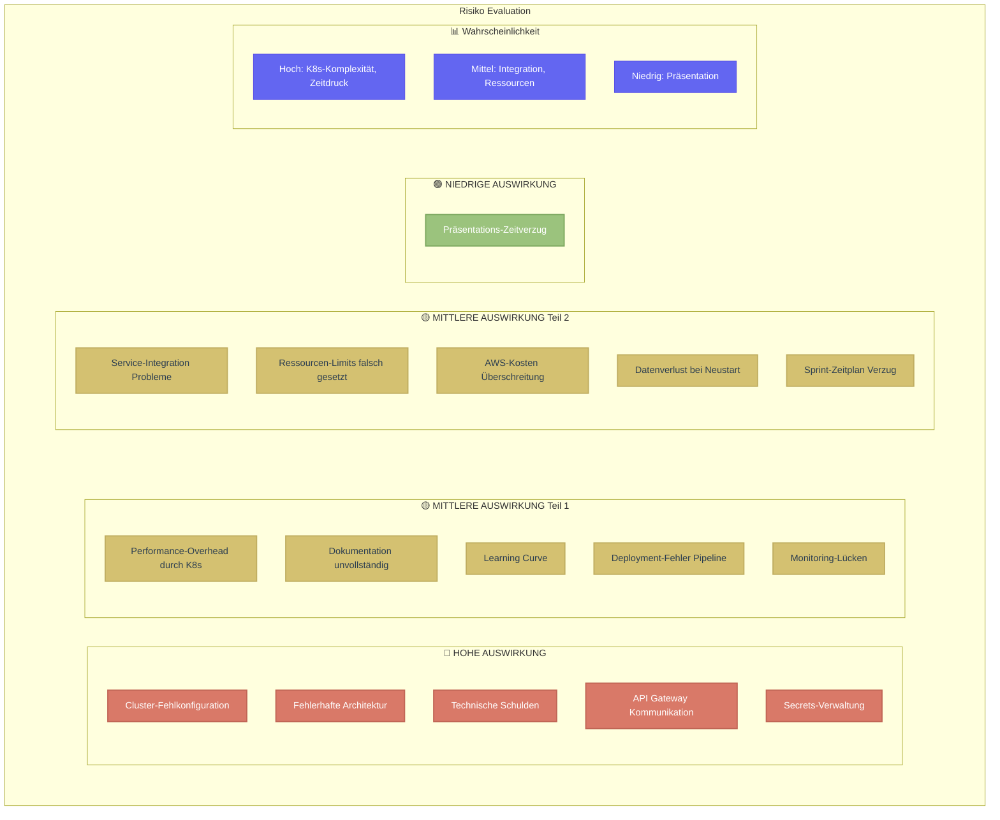
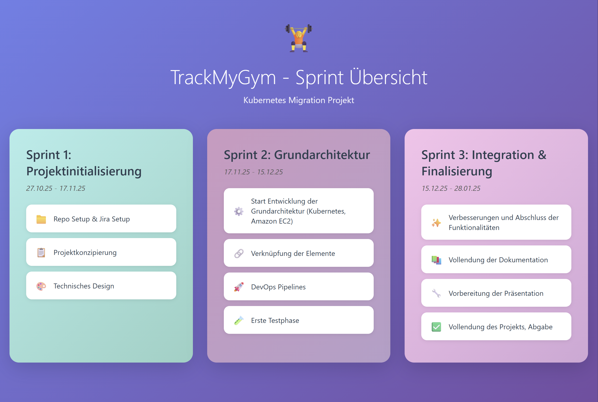
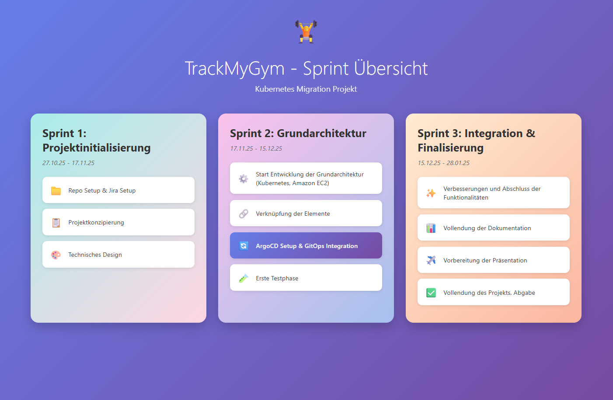

# README

# 🏋️‍♀️ FitTracker Pro - Kubernetes Version. Tracke. Wachse. Gewinne.


### Fitness Tracking Platform - Migriert auf Kubernetes


---

**Studierende:** Lilia Mechani | **Semester:** 4 | **Dozenten:** (PRJ) Corrado Parisi (CNC) Philip Stark.

[🚀 Live Demo](http://52.202.224.208/) • [📖 Repo](https://github.com/gitlilia-tbz/ICTNE24_Semesterarbeit3_L.M) • [🏗️ KanBan](https://semesterarbeit3liliam.atlassian.net/jira/software/projects/KAN/boards/1)

## Inhaltsverzeichnis

## 📋 Projektübersicht

### [1. 📊 Projektmanagement](#1--projektmanagement)

* [1.1 Projektbeschreibung](#11-projektbeschreibung)
* [1.2 Zeitplan](#12-zeitplan)
* [1.3 Risiko-Evaluation](#13-risiko-evaluation)
* [1.4 Risiko-Matrix](#14-risiko-matrix)
* [1.5 SWOT-Analyse](#15-swot-analyse)
* [1.6 Sprint-Dokumentation](#16-sprint-dokumentation)
  * [1.6.1 Sprint 1](#161-sprint-1)
  * [1.6.2 Sprint 2](#162-sprint-2)
  * [1.6.3 Sprint 3](#163-sprint-3)

* [1.7 Projekt Gantt-Diagramm](#18-projekt-gantt-diagramm)

### [2. 🛠️ Technische Dokumentation](#2-️-technische-dokumentation)

* [2.1 Architektur-Übersicht](#21-architektur-übersicht)

### [3. ☁️ Deployment & DevOps](#3-️-deployment--devops)

* [3.1 AWS EC2 Setup](#31-aws-ec2-setup)
* [3.2 Kubernetes Setup](#32-kubernetes-setup)
* [3.3 CI/CD Pipeline](#33-cicd-pipeline)
* [3.4 GitHub Actions](#34-github-actions)
* [3.5 Produktionsumgebung](#35-produktionsumgebung)

### [4. 📱 User Interface](#4--user-interface)

* [4.1 Frontend Design](#41-frontend-design)
* [4.2 User Experience](#42-user-experience)

### [5. 🧪 Testing & Qualitätssicherung](#5--testing--qualitätssicherung)

* [5.1 Pipeline-Testing](#51-pipeline-testing)
* [5.2 User-Testing](#52-user-testing)
* [5.3 10 Testfälle](#53-10-testfälle)

### [6. 📈 Ergebnisse & Reflexion](#6--ergebnisse--reflexion)

* [6.1 Erreichte Ziele](#61-erreichte-ziele)
* [6.2 Herausforderungen](#62-herausforderungen)
* [6.3 Lessons Learned](#63-lessons-learned)
* [6.4 Ausblick](#64-ausblick)

### [7. 📚 Anhang](#7--anhang)

* [7.1 Code-Repository](#71-code-repository)
* [7.2 Verwendete Technologien](#72-verwendete-technologien)
* [7.3 Quellen](#73-quellen)
* [7.4 Glossar](#74-glossar)
* [7.5 Kontaktangaben](#75-kontaktangaben)

---

# 1. 📊 Projektmanagement

## 1.1 Projektbeschreibung

Meine Microservices aus meiner letzten Semesterarbeit «TrackMyGym, Fitness Tracker PRO» werden nun in eine skalierbare Kubernetes-Umgebung übertragen. Weiterhin Cloud-Basiert und mit DevOps Pipelines deployable.
Zielsetzung der Semesterarbeit
Welche, z.B. als Aufstellung, Ziele sollen mit der Semesterarbeit erreicht werden.
Es sollten mindestens drei messbare Ziele aufgeführt werden.
1.  Die TrackMyGym Applikation bekommt ein neues Kleid. Die Microservices werden ins Kubernetes übertragen
2. Die Microservices werden innerhalb eines Skalierbaren Kubernetes Cluster betrieben. Diese wird in einer AWS EC2 Instanz gehostet. Bei erhöhter last, werden mehr Kubernetes Pods hochgefahren.
3. Eine CI/CD Pipeline wird innerhalb von GitHub Actions erstellt damit ein erfolgreiches Deployment des Images sowie Änderungen in der Code-Base nach Kubernetes erfolgen.


Die App soll auf folgenden Technologien basieren:

Werkzeuge:
-	Kubernetes -> Skalierbarkeit
-	GitHub -> Repo und Versionierung
-	Docker -> Image
-	VSCode + GitHub Add-in -> Source Code Editor und Dokumentation
-	Claude AI und Claude Code -> KI Unterstützte Entwicklung
-	Laptop -> Meine eigene Workstation

Durch die Migration zu Kubernetes wird die Applikation noch hochverfügbarer und somit Zukunftssicherer für eine breitere User-Adoption.

| :checkered_flag: Angezielte Kernfunktionen der neuen Infrastruktur                              |
| ------------------------------------------------------------------------------------------- |
| Folgende Ziele wurden gesetzt: |

1.  Die TrackMyGym Applikation bekommt ein neues Kleid. Die Microservices werden ins Kubernetes übertragen
2. Die Microservices werden innerhalb eines Skalierbaren Kubernetes Cluster betrieben. Diese wird in einer AWS EC2 Instanz gehostet. Bei erhöhter last, werden mehr Kubernetes Pods hochgefahren.
3. Eine CI/CD Pipeline wird innerhalb von GitHub Actions erstellt damit ein erfolgreiches Deployment des Images sowie Änderungen in der Code-Base nach Kubernetes erfolgen.


## 1.2 Zeitplan

Projektzeitleiste und Meilensteine


| Sprint | Zeitpunkt     | Arbeitsschritte                                                                          |
| -------- | --------------- | ------------------------------------------------------------------------------------------ |
| 1      | 27.10.25 - 17.11.25 | Repo Setup & Jira Setup, Projektkonzipierung, Technisches Design                                              |
| 2      | 17.11.25 - 15.12.25 | Start Entwicklung der Grundarchitektur (Kubernetes, Amazon EC2)                                                 |
| 2      | 17.11.25 - 15.12.25 | GUI-Planung, Erste Umsetzung der GUI                                                     |
| 2      | 17.11.25 - 15.12.25 | Verknüpfung der Elemente, DevOps Pipelines, Erste Testphase                       |
| 3      | 15.12.25 - 28.01.25| Verbesserungen und Abschluss der Funktionalitäten |
| 3      | 15.12.25 - 28.01.25 | Vollendung der Dokumentation                                                             |
| 3      | 15.12.25 - 28.01.25 | Vorbereitung der Präsentation, Vollendung des Projekts, Abgabe                          |

## 1.3 Risiko-Evaluation
Identifizierte Projektrisiken und deren Bewertung.



## 1.4 Risiko-Matrix
Übersicht der Risiken nach Wahrscheinlichkeit und Auswirkung.


## 1.5 SWOT-Analyse 
Stärken, Schwächen, Chancen und Risiken des Projektes innerhalb der SWOT Analyse.


## 1.6 Sprint-Dokumentation
### 1.6.1 Sprint 1
#### **Zeitraum**

27.10.25 - 17.11.25

---

#### **Sprintziele**

	Repo Setup, Projektkonzipierung, Technisches Design

---


#### **User Stories mit Akzeptanzkriterien**
---

📍​**User Story 1:**


| Title:                   | Priority: | Estimate: |
| -------------------------- | ----------- | ----------- |
| Repo-Setup & Jira Setup | High      | 2h        |


Als Entwickler
Möchte ich **Meinen Text-Editor oder IDE zu meinem Github-Repo verknüpfen und meine Jira Seite für die User-Stories / Tasks vorbereiten**
damit ich **Ready bin, um das Projekt zu entwickeln und meinen Vortschritt festzuhalten**.

**Akzeptanzkriterien:**

- Ein verfügbares Repository für die Dokumentation der Semesterarbeit
- Präferierter IDE / Text-Editor welcher aufs Repo zugreifen kann und aktiv änderungen vornimmt
- Meine User Stories im Jira festhalten

---

📍​**User Story 2:**


| Title:             | Priority: | Estimate: |
| -------------------- | ----------- | ----------- |
| Projektkonzipierung | High      | 1d        |


Als Projektleiterin
Möchte ich **Projektverlauf planen und die konzipierung verfassen**
damit ich **einen ersten Anhaltspunkt zum Architekturdesign habe, an welches sich das Projekt richten kann**.


**Akzeptanzkriterien:**

- Ein verfügbares KanBan Board mit den einzelnen Sprints und deren Ziele
- Die Funktionen Daten zu definieren und Cheklisten in den Zielen aufzubauen

---

📍​**User Story 3:**


| Title:              | Priority: | Estimate: |
| --------------------- | ----------- | ----------- |
| Technisches Design | Medium    | 1d        |

Als Architekt
Möchte ich **Einen ersten Entwurf meiner Grundarchitektur erstellen**
damit ich **meine Stakeholder den Fortschritt mitverfolgen können und ich Übersicht über die Aufgaben behalte**.
**Akzeptanzkriterien:**

- Ein Mermaid Diagramm mit der groben Vorstellung der Architektur
- Verständliche Beschriftung, Aufbau entsprechend der definierten Sachmittel

---

#### **Aufgabenübersicht Sprint 1**


| Aufgabe                  | Status              |
| -------------------------- | --------------------- |
| User Story 1 | Alternativ erledigt |
| User Story 2       | erledigt            |
| User Story 3    | erledigt            |

---

#### **Sprint Review**

⭐​​**Was wurde erreicht?**

- GitHub repo wurde erstellt
- IDE wurde mit GitHub verknüpft - Es wurde auf andere Lösung gewechselt - Da bessere Optionen zur Entwicklung
- Erster Entwurf einer groben Architekturplanung
- KanBan Board wurde erstellt - Microsoft Lists


*_KanBan Angfangs Sprint_


*_KanBan Ende Sprint_

#### 🏔️​ **Herausforderungen**

- Microsoft Lists bietet nicht alle benötigten Funktionen an. Es wurde am Anfang des 2. Sprints eine Ausweichmöglichkeit definiert
- Sprint 1 Zeitraum sehr klein


#### 📚​ **Lessons Learned**

- Mehr Austausch mit den Team-Kollegen und Collaboraters pflegen, um Lösungen zu vergleichen und voneinander zu profitieren. Durch einen Tipp von Teamkollegen, bin ich vollständig auf Visual-Studio gewechselt, da es wesentlich mehr Möglichkeiten anbietet, als Obsidian.

---

#### **Retrospektive**


| **📈 More Of**                                                                                                                                                                                             | **📉 Less Of**                                                                                       | **✅ Keep Doing**                                                                                                                                                       | **🛑 Stop Doing**                                                                                                                                                                                        |
| ------------------------------------------------------------------------------------------------------------------------------------------------------------------------------------------------------------ | ------------------------------------------------------------------------------------------------------ | ------------------------------------------------------------------------------------------------------------------------------------------------------------------------- | ---------------------------------------------------------------------------------------------------------------------------------------------------------------------------------------------------------- |
| **Mehr Austausch mit Team-Kollegen und Collaboraters pflegen**<br>• Lösungen vergleichen und voneinander profitieren <br>• Durch Teamkollegen-Tipp erfolgreich von Obsidian zu Visual Studio gewechselt | **Sprint-Zeitraum zu klein wählen**<br>• Sprint 1 Zeitraum war zu kurz für effektive Arbeitsweise | **Offenheit für Tool-Empfehlungen** <br>• Visual Studio bietet wesentlich mehr Möglichkeiten als Obsidian <br><br>** Proaktive Lösungssuche bei Tool-Limitationen** | ***Abhängigkeit von unvollständigen Tools ohne Backup-Plan***<br>• Microsoft Lists bietet nicht alle benötigten Funktionen <br>• Ausweichmöglichkeit wurde erst am Anfang des 2. Sprints definiert |

#### **Ausblick auf Sprint 2**

- Wechsel / Migration des KanBan-Board - **Tool-Migration abschließen** - Vollständiger Wechsel zu Visual Studio
- Start Entwicklung der Grundarchitektur
- GUI Planung und erste Umsetzung
### 1.6.2 Sprint 2
### 1.6.3 Sprint 3

# 2 Technische Dokumentation
## 2.1 Architektur Übersicht

Technische übersicht zur Migrierten Architektur:
``` Mermaid
graph TB
    %% External Users and Services
    User[👥 Benutzer<br/>HTTPS Zugriff]
    GitHub[🔄 GitHub Actions<br/>CI/CD Pipeline]
    WeatherAPI[☁️ OpenWeatherMap<br/>Weather API]
    
    %% AWS Cloud
    subgraph AWS["☁️ AWS Cloud (eu-central-1)"]
        subgraph EC2["🖥️ EC2 Instance (t3.medium)"]
            subgraph K8s["⎈ Kubernetes Cluster (k3s)"]
                
                %% Ingress
                Ingress[⚡ Nginx Ingress Controller<br/>Port 80/443]
                
                %% Kubernetes Services
                subgraph Namespace["📦 Namespace: trackmygym"]
                    Frontend[🎨 Frontend Pod<br/>React/Vue.js UI]
                    UserSvc[👤 User Service Pod<br/>Auth & Profile]
                    StatsSvc[📊 Stats Service Pod<br/>Analytics]
                    WorkoutSvc[💪 Workout Service Pod<br/>Training Plans]
                    WeatherSvc[🌤️ Weather Service Pod<br/>Weather Integration]
                    DB[(🗄️ PostgreSQL Pod<br/>users + workouts)]
                end
                
                %% Supporting Components
                HPA[📈 HPA<br/>Auto-Scaling]
            end
        end
    end
    
    %% Main User Flow
    User -->|HTTPS| Ingress
    Ingress -->|Routes| Frontend
    
    %% Frontend to Backend Services
    Frontend -->|API| UserSvc
    Frontend -->|API| StatsSvc
    Frontend -->|API| WorkoutSvc
    Frontend -->|API| WeatherSvc
    
    %% Services to Database
    UserSvc --> DB
    StatsSvc --> DB
    WorkoutSvc --> DB
    
    %% External API
    WeatherSvc -->|HTTP| WeatherAPI
    
    %% CI/CD Flow
    GitHub -->|Deploy| K8s
    
    %% Auto-Scaling
    HPA -.->|Scales| Namespace
    
    %% Styling
    classDef external fill:#e3f2fd,stroke:#1976d2,stroke-width:3px,color:#0d47a1
    classDef aws fill:#fff3e0,stroke:#f57c00,stroke-width:3px,color:#e65100
    classDef k8s fill:#e8f5e9,stroke:#43a047,stroke-width:3px,color:#2e7d32
    classDef service fill:#bbdefb,stroke:#1976d2,stroke-width:2px,color:#0d47a1
    classDef support fill:#fff9c4,stroke:#fbc02d,stroke-width:2px,color:#f57f17
    classDef db fill:#b3e5fc,stroke:#0288d1,stroke-width:3px,color:#01579b
    
    class User,GitHub,WeatherAPI external
    class AWS,EC2 aws
    class K8s,Namespace k8s
    class Frontend,UserSvc,StatsSvc,WorkoutSvc,WeatherSvc,Ingress service
    class HPA support
    class DB db
```