# README

# 🏋️‍♀️ FitTracker Pro - Kubernetes Version. Tracke. Wachse. Gewinne.


### Fitness Tracking Platform - Migriert auf Kubernetes


---

**Studierende:** Lilia Mechani | **Semester:** 4 | **Dozenten:** (PRJ) Corrado Parisi (CNC) Philip Stark.

[🚀 Live Demo](http://72.44.53.164:30080/) • [📖 Repo](https://github.com/gitlilia-tbz/ICTNE24_Semesterarbeit4_L.M) • [🏗️ KanBan](https://semesterarbeit3liliam.atlassian.net/jira/software/projects/KAN/boards/1)

Argo CD: http://72.44.53.164:8080


# Live Update:
- Vollendung der Dokumentation: In Progress

## Inhaltsverzeichnis

### [1. 📊 Projektmanagement](#1--projektmanagement)

* [1.1 Projektbeschreibung](#11-projektbeschreibung)
* [1.2 Zeitplan](#12-zeitplan)
* [1.3 Risiko-Evaluation](#13-risiko-evaluation)
* [1.4 Risiko-Matrix](#14-risiko-matrix)
* [1.5 SWOT-Analyse](#15-swot-analyse)
* [1.6 Sprint-Dokumentation](#16-sprint-dokumentation)
  * [1.6.1 Sprint 1](#161-sprint-1)
  * [1.6.2 Sprint 2](#162-sprint-2)
  * [1.6.3 Sprint 3](#163-sprint-3)

* [1.7 Projekt Gantt-Diagramm](#17-projekt-gantt-diagramm)

### [2. 🛠️ Technische Dokumentation](#2-️-technische-dokumentation)

* [2.1 Architektur-Übersicht](#21-architektur-übersicht)

### [3. ☁️ Deployment](#3-️-deployment)

* [3.1 AWS EC2 Setup](#31-aws-ec2-setup)
* [3.2 Kubernetes Setup](#32-kubernetes-setup)
* [3.3 ArgoCD](#33-argocd)
* [3.4 YAML Files](#34-yaml-files)
* [3.5 Produktionsumgebung](#35-produktionsumgebung)

### [4. 🧪 Testing & Qualitätssicherung](#4--testing--qualitätssicherung)

* [4.1  10 Testfälle](#41-10-testfälle)

### [5. 📈 Ergebnisse & Reflexion](#5--ergebnisse--reflexion)

* [5.1 Erreichte Ziele](#51-erreichte-ziele)
* [5.2 Herausforderungen](#52-herausforderungen)
* [5.3 Lessons Learned](#53-lessons-learned)
* [5.4 Ausblick](#54-ausblick)

### [6. 📚 Anhang](#6--anhang)

* [6.1 Code-Repository](#61-code-repository)
* [6.2 Verwendete Technologien](#62-verwendete-technologien)
* [6.3 Quellen](#63-quellen)
* [6.4 Glossar](#64-glossar)
* [6.5 Kontaktangaben](#65-kontaktangaben)

---

# 1. 📊 Projektmanagement

## 1.1 Projektbeschreibung

Meine Microservices aus meiner letzten Semesterarbeit «TrackMyGym, Fitness Tracker PRO» werden nun in eine skalierbare Kubernetes-Umgebung übertragen. Weiterhin Cloud-Basiert und mit DevOps Pipelines deployable.
Zielsetzung der Semesterarbeit
Welche, z.B. als Aufstellung, Ziele sollen mit der Semesterarbeit erreicht werden.
Es sollten mindestens drei messbare Ziele aufgeführt werden.
1.  Die TrackMyGym Applikation bekommt ein neues Kleid. Die Microservices werden ins Kubernetes übertragen
2. Die Microservices werden innerhalb eines Skalierbaren Kubernetes Cluster betrieben. Diese wird in einer AWS EC2 Instanz gehostet. Bei erhöhter last, werden mehr Kubernetes Pods hochgefahren.
3. Eine CI/CD Pipeline wird innerhalb von GitHub Actions erstellt damit ein erfolgreiches Deployment des Images sowie Änderungen in der Code-Base nach Kubernetes erfolgen.


Die App soll auf folgenden Technologien basieren:

Werkzeuge:
-	Kubernetes -> Skalierbarkeit
-	GitHub -> Repo und Versionierung
-	Docker -> Image
-	VSCode + GitHub Add-in -> Source Code Editor und Dokumentation
-	Claude AI und Claude Code -> KI Unterstützte Entwicklung
-	Laptop -> Meine eigene Workstation

Durch die Migration zu Kubernetes wird die Applikation noch hochverfügbarer und somit Zukunftssicherer für eine breitere User-Adoption.

| :checkered_flag: Angezielte Kernfunktionen der neuen Infrastruktur                              |
| ------------------------------------------------------------------------------------------- |
| Folgende Ziele wurden gesetzt: |

1.  Die TrackMyGym Applikation bekommt ein neues Kleid. Die Microservices werden ins Kubernetes übertragen
2. Die Microservices werden innerhalb eines Skalierbaren Kubernetes Cluster betrieben. Diese wird in einer AWS EC2 Instanz gehostet. Bei erhöhter last, werden mehr Kubernetes Pods hochgefahren.
3. Eine CI/CD Pipeline wird innerhalb von GitHub Actions erstellt damit ein erfolgreiches Deployment des Images sowie Änderungen in der Code-Base nach Kubernetes erfolgen.


## 1.2 Zeitplan

Projektzeitleiste und Meilensteine
 


## 1.3 Risiko-Evaluation
Identifizierte Projektrisiken und deren Bewertung.


## 1.4 Risiko-Matrix
Übersicht der Risiken nach Wahrscheinlichkeit und Auswirkung.


## Massnahmen zur Risiko-Matrix

### Hohe Auswirkung

| Risiko | Massnahme |
|--------|-----------|
| Cluster-Fehlkonfiguration | Infrastructure-as-Code mit Code-Reviews einführen (KI-gestützt). |
| Fehlerhafte Architektur | Architektur-Review vor Go-Live (KI-gestützt). |
| Technische Schulden | Sprints mit Bufferzeit fest einplanen. |
| API Gateway Kommunikation | Ingress-Controller und End-to-End-Tests durchführen. |
| Secrets-Verwaltung | Vault oder AWS Secrets Manager einsetzen. |
| Sprint-Zeitplan Verzug | 20% Puffer einplanen, kritischen Pfad tracken. |

### Mittlere Auswirkung

| Risiko | Massnahme |
|--------|-----------|
| Service-Integration Probleme | Service Mesh evaluieren. |
| Ressourcen-Limits falsch gesetzt | Lasttests durchführen, Limits anpassen. |
| AWS-Kosten Überschreitung | Budget-Alerts und wöchentliches Monitoring. |
| Datenverlust bei Neustart | Stabile Datenbanken implementieren. |
| Deployment-Fehler Pipeline | Automatisierte Tests und Rollback einbauen. |
| Monitoring-Lücken | ArgoCD einsetzen. |
| Performance-Overhead durch K8s | Autoscaler und Ressourcen-Requests optimieren. |
| Dokumentation unvollständig | Definition of Done festlegen. |
| Learning Curve | Rücksprache mit den Dozenten durchführen. |


## 1.5 SWOT-Analyse 
Stärken, Schwächen, Chancen und Risiken des Projektes innerhalb der SWOT Analyse.


## 1.6 Sprint-Dokumentation
### 1.6.1 Sprint 1
#### **Zeitraum**

27.10.25 - 17.11.25

---

#### **Sprintziele**

	Repo Setup, Projektkonzipierung, Technisches Design

---


#### **User Stories mit Akzeptanzkriterien**
---

📍​**User Story 1:**
https://liliamechani.atlassian.net/browse/SCRUM-1


| Title:                   | Priority: | Estimate: |
| -------------------------- | ----------- | ----------- |
| Repo-Setup & Jira Setup | High      | 2h        |


Als Entwickler
Möchte ich **Meinen Text-Editor oder IDE zu meinem Github-Repo verknüpfen und meine Jira Seite für die User-Stories / Tasks vorbereiten**
damit ich **Ready bin, um das Projekt zu entwickeln und meinen Vortschritt festzuhalten**.

**Akzeptanzkriterien:**

- Ein verfügbares Repository für die Dokumentation der Semesterarbeit
- Präferierter IDE / Text-Editor welcher aufs Repo zugreifen kann und aktiv Änderungen vornimmt
- Meine User Stories im Jira festhalten

---

📍​**User Story 2:**
https://liliamechani.atlassian.net/browse/SCRUM-2


| Title:             | Priority: | Estimate: |
| -------------------- | ----------- | ----------- |
| Projektkonzipierung | High      | 1d        |


Als Projektleiterin
Möchte ich **Projektverlauf planen und die konzipierung verfassen**
damit ich **einen ersten Anhaltspunkt zum Architekturdesign habe, an welches sich das Projekt richten kann**.


**Akzeptanzkriterien:**

- Ein verfügbares KanBan Board mit den einzelnen Sprints und deren Ziele
- Die Funktionen Daten zu definieren und Cheklisten in den Zielen aufzubauen

---

📍​**User Story 3:**
https://liliamechani.atlassian.net/browse/SCRUM-3


| Title:              | Priority: | Estimate: |
| --------------------- | ----------- | ----------- |
| Technisches Design | Medium    | 1d        |

Als Architekt
Möchte ich **Einen ersten Entwurf meiner Grundarchitektur erstellen**
damit ich **meine Stakeholder den Fortschritt mitverfolgen können und ich Übersicht über die Aufgaben behalte**.
**Akzeptanzkriterien:**

- Ein Mermaid Diagramm mit der groben Vorstellung der Architektur
- Verständliche Beschriftung, Aufbau entsprechend der definierten Sachmittel

---

#### **Aufgabenübersicht Sprint 1**


| Aufgabe                  | Status              |
| -------------------------- | --------------------- |
| User Story 1 | Alternativ erledigt |
| User Story 2       | erledigt            |
| User Story 3    | erledigt            |

---

#### **Sprint Review**

⭐​​**Was wurde erreicht?**

- GitHub repo & Jira Setup erledigt
- Projektkonzipierung wurde erstellt
- Erster Entwurf für das Technische Design wurde erstellt


*_KanBan Angfangs Sprint_


*_KanBan Ende Sprint_

#### 🏔️​ **Herausforderungen**

- Jira Setup war sehr Mühsam. Mein Account war gesperrt und ich musste einen neuen Account sowie eine neue Site erstellen


#### 📚​ **Lessons Learned**

- Durch den Free-Tier von Jira ist man nur auf eine Domäne eingeschränkt
- Domänen und Sites sind zwei verschiedene Dinge
- Jira / Confluence Pages mit der Free-Tier werden nach ungefähr 6 Monaten gesperrt

---

#### **Retrospektive**


| **📈 More Of**                                                                                                                                                                                             | **📉 Less Of**                                                                                       | **✅ Keep Doing**                                                                                                                                                       | **🛑 Stop Doing**                                                                                                                                                                                        |
| ------------------------------------------------------------------------------------------------------------------------------------------------------------------------------------------------------------ | ------------------------------------------------------------------------------------------------------ | ------------------------------------------------------------------------------------------------------------------------------------------------------------------------- | ---------------------------------------------------------------------------------------------------------------------------------------------------------------------------------------------------------- |
| **Mehr Austausch mit Team-Kollegen und Collaboraters pflegen**<br>• Lösungen vergleichen und voneinander profitieren <br> | **Thema Microsoft Bookings**<br>• Via Bookings Termin früher Buchen. Slots sind schnell weg | **Offenheit für Tool-Empfehlungen** <br>• Visual Studio bietet wesentlich mehr Möglichkeiten als Obsidian <br><br>** Proaktive Lösungssuche bei Tool-Limitationen** | ***Kein Stop Doing Thema offen***<br>

#### **Ausblick auf Sprint 2**

- Wechsel / Migration des KanBan-Board - **Tool-Migration abschließen** - Vollständiger Wechsel zu Visual Studio
- Start Entwicklung der Grundarchitektur
- GUI Planung und erste Umsetzung
### 1.6.2 Sprint 2

#### **Zeitraum**

* Disclaimer: Anpassung der Technischen Lösung von DevOps Pipeline zu ArgoCD

17.11.25 - 15.12.25

---

#### **Sprintziele**

	Start Entwicklung Grundarchitektur; Verknüpfung aller Technischen Elemente sowie erste Testphase

---


#### **User Stories mit Akzeptanzkriterien**
---

📍​**User Story 4:**
https://liliamechani.atlassian.net/browse/SCRUM-13


| Title:                   | Priority: | Estimate: |
| -------------------------- | ----------- | ----------- |
| Entwicklung Grundarchitektur (AWS & Kubernetes) | High      | 2d        |


Als Entwickler
Möchte ich **Meine AWS EC2 Instanz aufsetzen sowie die Kubernetes Services für meine Microservices bereitstellen**
damit ich **Ready bin, um die Services zu Verknüpfen und ArgoCD zu initiieren**.

**Akzeptanzkriterien:**

- Eine verfügbare EC2 Instanz
- Installiertes Kubernetes auf der Instanz

---

📍​**User Story 5:**
https://liliamechani.atlassian.net/browse/SCRUM-14


| Title:             | Priority: | Estimate: |
| -------------------- | ----------- | ----------- |
| Verknüpfung der Technischen Elemente | High      | 2d        |


Als Entwickler
Möchte ich **Die Technischen Elemente (EC2, Kubernetes & ArgoCD, Deployment Manifests und deren Microservices)** bereitstellen
damit ich **auf neine erste funktionstüchtige ArgoCD Instanz zugreifen kann**.


**Akzeptanzkriterien:**

- Eine verfügbare ArgoCD GUI
- Ein gesundes cluster
- Erster Zugriff auf die Microservices

---
📍​**User Story 6:**
https://liliamechani.atlassian.net/browse/SCRUM-15


| Title:              | Priority: | Estimate: |
| --------------------- | ----------- | ----------- |
| ArgoCD Setup | Medium    | 1d        |

Als Entwickler
Möchte ich **Die Verfügbarkeit von ArgoCD gewährleisten**
damit ich **eine Übersicht auf meine aktiven Cluster sowie der Microservices erhalte**

**Akzeptanzkriterien:**

- WebGUI von Argo CD ersichtlich


---


📍​**User Story 7:**
https://liliamechani.atlassian.net/browse/SCRUM-17


| Title:              | Priority: | Estimate: |
| --------------------- | ----------- | ----------- |
| Testing | Medium    | 1d        |

Als Tester
Möchte ich **Die Verfügbarkeit und Funktionalitäten meiner Microservices testen**
damit ich **eine stabile Umgebung gewährleisten kann**

**Akzeptanzkriterien:**

- WebGUI von TrackMyGym ersichtlich
- Erstellung der Workout-Einträge möglich
- Wettervorhersagen entsprechend des Workouts verfügbar

---

#### **Aufgabenübersicht Sprint 2**


| Aufgabe                  | Status              |
| -------------------------- | --------------------- |
| User Story 4 | Erledigt |
| User Story 5       | Erledigt         |
| User Story 6    | Erledigt      |
| User Story 7    | Erledigt       |

---

#### **Sprint Review**

⭐​​**Was wurde erreicht?**

- EC2 Instanz erstellt und Security Group konfiguriert
- Kubernetes auf der Instanz Installiert
- Für Docker-Hub Images generiert
- Datei-Struktur für die Microservices erstellt
- ArgoCD Installation sowie Verfügbarkeit der Konsole gewährleistet
- Microservices hochgefahren
- Fehler behoben
- Microservices getestet

In Sprint 2 wurde die Cloud-Infrastruktur aufgebaut: EC2-Instanz erstellt, Security Group konfiguriert und Kubernetes (K3s) installiert. Alle Microservices wurden als Docker Images auf Docker Hub gepusht und die Kubernetes-Manifests im Repository strukturiert angelegt.
ArgoCD wurde als GitOps-Tool eingerichtet und alle Services erfolgreich deployed. Nach Fehlerbehebung und Tests ist die Applikation nun vollständig funktionsfähig und öffentlich erreichbar.
  


#### 🏔️​ **Herausforderungen**

-  Der Sprint wurde durch gesundheitliche Vorfälle im persönlichen Umfeld verzögert. Dadurch verschob sich die Zeitspanne von Sprint 2, was zu zeitlichen Konflikten mit anderen Verpflichtungen führte.


#### 📚​ **Lessons Learned**

- Ich habe Kubernetes näher kennengelernt und das Konzept von ArgoCD sowie Docker Hub mit Images besser verstanden, dadurch fiel mir die Arbeit mit diesen Technologien etwas einfacher. Zudem habe ich die wesentlichen Unterschiede zwischen Kubernetes/ArgoCD und Docker zusätzlich besser verstanden: Docker dient eher der Containerisierung einzelner Anwendungen, während Kubernetes diese Container orchestriert, skaliert und verwaltet. ArgoCD ergänzt dies durch GitOps – Änderungen im Git-Repository werden automatisch auf den Kubernetes-Cluster synchronisiert und stets überwacht.

- Was die Projektplanung anbelangt heisst es: die Sprints Zeitnahe / Zeitgerecht zu aktualisieren sowie das Review pünktlich zum Ende des Sprints zu dokumentieren. Wenn dies nicht möglich erscheint, Stakeholder pünktlich zu informieren.

---

#### **Retrospektive**


| **📈 More Of**                                                                                                                                                                                             | **📉 Less Of**                                                                                       | **✅ Keep Doing**                                                                                                                                                       | **🛑 Stop Doing**                                                                                                                                                                                        |
| ------------------------------------------------------------------------------------------------------------------------------------------------------------------------------------------------------------ | ------------------------------------------------------------------------------------------------------ | ------------------------------------------------------------------------------------------------------------------------------------------------------------------------- | ---------------------------------------------------------------------------------------------------------------------------------------------------------------------------------------------------------- |
| <br>**Frühzeitig mit neuen Technologien experimentieren, Dokumentation während der Arbeit erstellen, Pufferzeit für unvorhergesehene Ereignisse, Stakeholder frühzeitig informieren**  <br> | <br> **Mehrere komplexe Themen gleichzeitig angehen** | **Strukturierte Ordnerstruktur im Repository, GitOps-Ansatz mit ArgoCD** <br> | ***Zu lange an einem Problem festhalten ohne Hilfe zu suchen***<br>

#### **Ausblick auf Sprint 3**

- Abschluss der Dokumentation im GitRepo
- Start Design der Pitch-Präsentation
- Abgabe des Projektes
### 1.6.3 Sprint 3
#### **Zeitraum**

* Disclaimer: Anpassung der Technischen Lösung von DevOps Pipeline zu ArgoCD

15.12.25 - 28.01.25

---

#### **Sprintziele**

	Verbesserungen und Abschluss der Funktionalitäten, Vollendung der Dokumentation, Vorbereitung der Präsentation, Vollendung des Projekts & Abgabe

---


#### **User Stories mit Akzeptanzkriterien**
---

📍​**User Story 8:**
https://liliamechani.atlassian.net/browse/SCRUM-18


| Title:                   | Priority: | Estimate: |
| -------------------------- | ----------- | ----------- |
| Verbesserungen und Abschluss der Funktionalitäten | Medium      | 2d        |


Als Entwickler
Möchte ich **Allfällige Verbesserungen & Schönheitsmerkmale** umsetzen
damit ich **dem Projekt einen Feinschliff verleien kann (GUI, Zugriffe)**.

**Akzeptanzkriterien:**

- Eine GUI welches dem letzen Projekt gleich kommt
- Einfache Zugriffe auf die Instanz (Domänenname)
---

📍​**User Story 9:**
https://liliamechani.atlassian.net/browse/SCRUM-19


| Title:             | Priority: | Estimate: |
| -------------------- | ----------- | ----------- |
| Vollendung der Dokumentation | High      | 3d        |


Als Projektleiterin
Möchte ich **Meine Dokumentation auf dem Repo vollenden**
damit ich **Alle Themenbereiche des Projektes abgedeckt habe**.


**Akzeptanzkriterien:**

- Vollständige Dokumentation mit allen Überthemen auf dem aktuellen Repo

---
📍​**User Story 10:**
https://liliamechani.atlassian.net/browse/SCRUM-20


| Title:              | Priority: | Estimate: |
| --------------------- | ----------- | ----------- |
| Vorbereitung der Präsentation | Medium    | 1d        |

Als Sales Representative
Möchte ich **Eine Präsentation in Form eines Pitch** vorbereiten
damit ich **das Projekt den Stakeholdern vorstellen kann**

**Akzeptanzkriterien:**

- PowerPoint Präsentation mit live-Demo
---
📍​**User Story 11:**
https://liliamechani.atlassian.net/browse/SCRUM-21


| Title:              | Priority: | Estimate: |
| --------------------- | ----------- | ----------- |
| Vollendung des Projekts, Abgabe | Highest    | 1d        |

Als Projektleiter
Möchte ich **mein Projekt** abgeben
damit ich den Dozenten die Bewertung meines Projektes ermögliche.

**Akzeptanzkriterien:**

- Abgabe vollständiges Repo mit allen Dateien
- Abgabe PP Präsentation
- Abgabe allfällige Kommentare in Form eines Teams Posts
---

#### **Aufgabenübersicht Sprint 2**


| Aufgabe                  | Status              |
| -------------------------- | --------------------- |
| User Story 8 | In Progress |
| User Story 9       | In Progress         |
| User Story 10    | In Progress      |
| User Story 11    | In Progress       |


---

#### **Sprint Review**

⭐​​**Was wurde erreicht?**

- Repo vollendet
- Präsentation vorbereitet
- Cross-Check mit Klassenkameraden durchgeführt


#### 🏔️​ **Herausforderungen**

- Zeitverschiebung Sprint 2 auf Sprint 3

#### 📚​ **Lessons Learned**

- 

---

#### **Retrospektive**


| **📈 More Of**                                                                                                                                                                                             | **📉 Less Of**                                                                                       | **✅ Keep Doing**                                                                                                                                                       | **🛑 Stop Doing**                                                                                                                                                                                        |
| ------------------------------------------------------------------------------------------------------------------------------------------------------------------------------------------------------------ | ------------------------------------------------------------------------------------------------------ | ------------------------------------------------------------------------------------------------------------------------------------------------------------------------- | ---------------------------------------------------------------------------------------------------------------------------------------------------------------------------------------------------------- |
| **...**<br>• ... <br> | **...**<br>• ... | **...** <br>• .... <br><br>** ...** | ***...***<br>


## 1.7 Projekt Gantt-Diagramm

*Gantt-Diagramm wird hier eingefügt*

---

# 2. 🛠️ Technische Dokumentation
## 2.1 Architektur-Übersicht

Technische übersicht zur Migrierten Architektur:

```mermaid
graph TB
    %% External Users and Services
    User[👥 Benutzer<br/>HTTPS Zugriff]
    GitHub[🔄 GitHub Actions<br/>CI/CD Pipeline]
    WeatherAPI[☁️ OpenWeatherMap<br/>Weather API]
    
    %% AWS Cloud
    subgraph AWS["☁️ AWS Cloud (eu-central-1)"]
        subgraph EC2["🖥️ EC2 Instance (t3.medium)"]
            subgraph K8s["⎈ Kubernetes Cluster (k3s)"]
                
                %% Ingress
                Ingress[⚡ Nginx Ingress Controller<br/>Port 80/443]
                
                %% Kubernetes Services
                subgraph Namespace["📦 Namespace: trackmygym"]
                    Frontend[🎨 Frontend Pod<br/>React/Vue.js UI]
                    UserSvc[👤 User Service Pod<br/>Auth & Profile]
                    StatsSvc[📊 Stats Service Pod<br/>Analytics]
                    WorkoutSvc[💪 Workout Service Pod<br/>Training Plans]
                    WeatherSvc[🌤️ Weather Service Pod<br/>Weather Integration]
                    DB[(🗄️ PostgreSQL Pod<br/>users + workouts)]
                end
                
                %% Supporting Components
                HPA[📈 HPA<br/>Auto-Scaling]
            end
        end
    end
    
    %% Main User Flow
    User -->|HTTPS| Ingress
    Ingress -->|Routes| Frontend
    
    %% Frontend to Backend Services
    Frontend -->|API| UserSvc
    Frontend -->|API| StatsSvc
    Frontend -->|API| WorkoutSvc
    Frontend -->|API| WeatherSvc
    
    %% Services to Database
    UserSvc --> DB
    StatsSvc --> DB
    WorkoutSvc --> DB
    
    %% External API
    WeatherSvc -->|HTTP| WeatherAPI
    
    %% CI/CD Flow
    GitHub -->|Deploy| K8s
    
    %% Auto-Scaling
    HPA -.->|Scales| Namespace
    
    %% Styling
    classDef external fill:#e3f2fd,stroke:#1976d2,stroke-width:3px,color:#0d47a1
    classDef aws fill:#fff3e0,stroke:#f57c00,stroke-width:3px,color:#e65100
    classDef k8s fill:#e8f5e9,stroke:#43a047,stroke-width:3px,color:#2e7d32
    classDef service fill:#bbdefb,stroke:#1976d2,stroke-width:2px,color:#0d47a1
    classDef support fill:#fff9c4,stroke:#fbc02d,stroke-width:2px,color:#f57f17
    classDef db fill:#b3e5fc,stroke:#0288d1,stroke-width:3px,color:#01579b
    
    class User,GitHub,WeatherAPI external
    class AWS,EC2 aws
    class K8s,Namespace k8s
    class Frontend,UserSvc,StatsSvc,WorkoutSvc,WeatherSvc,Ingress service
    class HPA support
    class DB db
```


| Komponente | Beschreibung |
|------------|--------------|
| **Benutzer mit HTTPS Zugriff** | Externe Clients greifen über HTTPS auf das System zu |
| **EC2 Bucket** | Cloud-Speicher für statische Ressourcen |
| **Nginx Ingress Controller** | Routing und Load Balancing für eingehende Anfragen |
| **GitHub CI/CD Pipeline / Namespace** | Automatisierte Deployment-Pipeline |
| **Frontend Pod** | Weboberfläche für Benutzerinteraktion |
| **User Service Pod** | Benutzerverwaltung und Authentifizierung |
| **Stats Service Pod** | Statistik- und Analyseservice |
| **Workout Service Pod** | Verwaltung von Workout-Daten |
| **Weather Service Pod** | Wetterdaten-Integration und -Verarbeitung |
| **PostgreSQL Pod** | Relationale Datenbank für persistente Daten |
| **OpenWeatherMap API** | Externe API für aktuelle Wetterdaten |


## 2.1 Architektur-Übersicht - Angepasst

:bulb: Nach Besprechnungen mit den Dozenten Philip Stark sowie Thanam Pangri bin ich auf die Idee einer Anpassung der Technischen Lösung gekommen.
Diese ist auf Positive Rückmeldung seitens der beiden Dozenten gestossen.

:unlock: Anstatt der klassichen DevOps Pipelines via GitHub Actions, setze ich auf eine Umsetzung mit ArgoCD.

:mag_right: Wieso ArgoCD?

- ArgoCD bietet für den Zweck der Microservices eine deutlich übersichtliche Oberfläche für das Managen sowie des Überwachen der Cluster. Mittels der Self-Healing Funktionalitäten bieter ArgoCD somit eine stabile Lösung für den Gebrauch in einer Live-Umgebung.
- ArgoCD gleicht sich ständig mit dem Repo ab als "Single Point of Truth". Alle commits sind nachvollziehbar.

- ArgoCD bietet eine übersichtliche Web GUI, die den Zustand der Microservices, den Ressourcen und deren Beziehungen darstellt. So siehst man schnell, was deployed ist und wo es Probleme gibt.

:key: Dies ist nach meiner Reflexion über meiner Technischen Planung eine passendere und nachhaltigere Lösung für meine Microservices.

Technische Übersicht zur ArgoCD Lösung:

```mermaid
graph TB
    %% External Users and Services
    User[👥 Benutzer<br/>HTTPS Zugriff]
    GitRepo[📁 Git Repository<br/>Manifests & Config]
    WeatherAPI[☁️ OpenWeatherMap<br/>Weather API]
    
    %% AWS Cloud
    subgraph AWS["☁️ AWS Cloud (eu-central-1)"]
        subgraph EC2["🖥️ EC2 Instance (t3.medium)"]
            subgraph K8s["⎈ Kubernetes Cluster (k3s)"]
                
                %% ArgoCD
                ArgoCD[🔄 ArgoCD<br/>GitOps Controller]
                
                %% Ingress
                Ingress[⚡ Nginx Ingress Controller<br/>Port 80/443]
                
                %% Kubernetes Services
                subgraph Namespace["📦 Namespace: trackmygym"]
                    Frontend[🎨 Frontend Pod<br/>React/Vue.js UI]
                    UserSvc[👤 User Service Pod<br/>Auth & Profile]
                    StatsSvc[📊 Stats Service Pod<br/>Analytics]
                    WorkoutSvc[💪 Workout Service Pod<br/>Training Plans]
                    WeatherSvc[🌤️ Weather Service Pod<br/>Weather Integration]
                    DB[(🗄️ PostgreSQL Pod<br/>users + workouts)]
                end
                
                %% Supporting Components
                HPA[📈 HPA<br/>Auto-Scaling]
            end
        end
    end
    
    %% Main User Flow
    User -->|HTTPS| Ingress
    Ingress -->|Routes| Frontend
    
    %% Frontend to Backend Services
    Frontend -->|API| UserSvc
    Frontend -->|API| StatsSvc
    Frontend -->|API| WorkoutSvc
    Frontend -->|API| WeatherSvc
    
    %% Services to Database
    UserSvc --> DB
    StatsSvc --> DB
    WorkoutSvc --> DB
    
    %% External API
    WeatherSvc -->|HTTP| WeatherAPI
    
    %% GitOps Flow
    GitRepo -->|Monitored by| ArgoCD
    ArgoCD -->|Sync & Deploy| Namespace
    ArgoCD -.->|Auto-Sync| Ingress
    
    %% Auto-Scaling
    HPA -.->|Scales| Namespace
    
    %% Styling
    classDef external fill:#e3f2fd,stroke:#1976d2,stroke-width:3px,color:#0d47a1
    classDef aws fill:#fff3e0,stroke:#f57c00,stroke-width:3px,color:#e65100
    classDef k8s fill:#e8f5e9,stroke:#43a047,stroke-width:3px,color:#2e7d32
    classDef service fill:#bbdefb,stroke:#1976d2,stroke-width:2px,color:#0d47a1
    classDef support fill:#fff9c4,stroke:#fbc02d,stroke-width:2px,color:#f57f17
    classDef db fill:#b3e5fc,stroke:#0288d1,stroke-width:3px,color:#01579b
    classDef argocd fill:#fce4ec,stroke:#c2185b,stroke-width:3px,color:#880e4f
    
    class User,WeatherAPI external
    class GitRepo argocd
    class AWS,EC2 aws
    class K8s,Namespace k8s
    class Frontend,UserSvc,StatsSvc,WorkoutSvc,WeatherSvc,Ingress service
    class HPA support
    class DB db
    class ArgoCD argocd
    
```

# System-Komponenten Übersicht

| Komponente | Beschreibung |
|------------|--------------|
| **Benutzer HTTPS Zugriff** | Externe Clients greifen über HTTPS auf das System zu |
| **Git Repository Manifests & Config** | Versionskontrolle für Konfiguration und Manifests |
| **AWS Cloud (eu-central-1)** | Cloud-Umgebung in der Region EU-Central-1 |
| **EC2 Instance** | Virtuelle Serverinstanz für Kubernetes |
| **Kubernetes Cluster (k3s)** | Leichtgewichtige Kubernetes-Distribution |
| **ArgoCD GitOps Controller** | Automatisches Deployment basierend auf Git |
| **Nginx Ingress Controller Port 80/443** | Routing und Load Balancing für HTTP/HTTPS |
| **HPA Auto-Scaling** | Automatische horizontale Pod-Skalierung |
| **Namespace** | Isolierte Umgebung für Services |
| **Frontend Pod React/Vue.js UI** | Weboberfläche für Benutzerinteraktion |
| **User Service Pod Auth & Profile** | Benutzerverwaltung und Authentifizierung |
| **Stats Service Pod Analytics** | Statistik- und Analyseservice |
| **Workout Service Pod Training Plans** | Verwaltung von Trainingsplänen |
| **Weather Service Pod Weather Integration** | Wetterdaten-Integration und -Verarbeitung |
| **PostgreSQL Pod users + workouts** | Datenbank für Benutzer- und Workout-Daten |
| **OpenWeatherMap Weather API** | Externe API für aktuelle Wetterdaten |



- Was sind die Hauptunterschiede?
- 1. DevOps Pipelines wurden in der Grafik entfernt
- 2. ArgoCD wurde in der Architekturübersicht hinzugefügt
- 3. ArgoCD wurde mit den Microservices verknüpft

  
 | Somit hat sich auch ein Element meiner Sprint Übersicht angepasst:


# 3. ☁️ Deployment
## 3.1 AWS EC2 Setup

### Kostenmanagement
#### Billing-Alerts und threshholds für aktive Sessions


### EC2 Eigenschaften
#### Eigenschaften der Instanz

```
# - Instance Type: t3.medium oder größer (2 vCPU, 4 GB RAM minimum)
# - OS: Ubuntu 22.04 LTS
# - Storage: 30 GB SSD minimum
# - Security Group: Ports 22, 80, 443, 6443 (Kubernetes API)
```


#### Eigenschaften des Betriebssystem

#### User Data Eintrag
Damit das System auf dem neusten Stand bleibt


#### Eigenschaften der Security Group Regeln
```
Inbound Security Group Rules

SSH (bereits vorhanden)

Type: SSH
Port: 22
Source: My IP (oder 0.0.0.0/0)


HTTP

Type: HTTP
Port: 80
Source: Anywhere (0.0.0.0/0)


HTTPS

Type: HTTPS
Port: 443
Source: Anywhere (0.0.0.0/0)


Kubernetes

Type: Custom TCP
Port: 6443
Source: My IP (für kubectl Zugriff)
```


## 3.2 Kubernetes Setup
### K3S Installation
```
# Auf EC2 Instanz ausführen:
curl -sfL https://get.k3s.io | sh -

# kubectl konfigurieren
sudo cp /etc/rancher/k3s/k3s.yaml ~/.kube/config
sudo chown $USER ~/.kube/config

# Cluster Status prüfen
kubectl get nodes
```


### Bestehende Sudo Berechtigungen 

### Problem
Nach der k3s Installation konnte kubectl nicht ohne `sudo` verwendet werden, da die Standard-Konfigurationsdatei `/etc/rancher/k3s/k3s.yaml` nur für root lesbar ist.

### Lösung

#### Schritt 1: .kube Verzeichnis erstellen
```bash
mkdir -p ~/.kube
```

#### Schritt 2: k3s Konfiguration kopieren
```bash
sudo cp /etc/rancher/k3s/k3s.yaml ~/.kube/config
```

#### Schritt 3: Berechtigungen setzen
```bash
sudo chown ubuntu:ubuntu ~/.kube/config
chmod 600 ~/.kube/config
```

#### Schritt 4: KUBECONFIG Umgebungsvariable setzen
```bash
# Für die aktuelle Session
export KUBECONFIG=~/.kube/config

# Dauerhaft in .bashrc einfügen
echo 'export KUBECONFIG=~/.kube/config' >> ~/.bashrc

# .bashrc neu laden
source ~/.bashrc
```

#### Schritt 5: Funktionalität testen
```bash
kubectl get nodes
```

**Erwartete Ausgabe:**
```
NAME               STATUS   ROLES           AGE     VERSION
ip-172-31-27-185   Ready    control-plane   5d10h   v1.34.3+k3s1
```

#### Zusammenfassung

Nach diesen Schritten kann kubectl ohne `sudo` verwendet werden. Die KUBECONFIG Umgebungsvariable zeigt auf die Benutzerkopie der Konfiguration (`~/.kube/config`), die die korrekten Berechtigungen hat.

### Nützliche Befehle

```bash
# Cluster-Info anzeigen
kubectl cluster-info

# Alle Namespaces anzeigen
kubectl get namespaces

# Pods in einem Namespace anzeigen
kubectl get pods -n trackmygym

# Aktuelle Konfiguration anzeigen
kubectl config view
```


### Namespace erstellen

```bash
# TrackMyGym Namespace erstellen
kubectl create namespace trackmygym

# Überprüfen
kubectl get namespaces
```


### Repository Struktur
````
📂 k8s/
├── 📄 .gitignore
├── 📂 apps/
│   ├── 📂 frontend/
│   │   ├── 📄 deployment.yaml
│   │   └── 📄 service.yaml
│   ├── 📂 user-service/
│   │   ├── 📄 deployment.yaml
│   │   └── 📄 service.yaml
│   ├── 📂 workout-service/
│   │   ├── 📄 deployment.yaml
│   │   └── 📄 service.yaml
│   ├── 📂 stats-service/
│   │   ├── 📄 deployment.yaml
│   │   └── 📄 service.yaml
│   └── 📂 weather-service/
│       ├── 📄 deployment.yaml
│       └── 📄 service.yaml
│
├── 📂 database/
│   ├── 📄 postgres-pvc.yaml
│   ├── 📄 postgres-statefulset.yaml
│   ├── 📄 postgres-configmap.yaml
│   ├── 📄 postgres-secret.yaml
│   └── 📄 postgres-service.yaml
│
├── 📂 ingress/
│   ├── 📄 ingress.yaml
│   ├── 📄 nginx-ingress-controller.yaml
│   └── 📄 trackmygym-ingress.yaml
│
├── 📂 argocd/
│   ├── 📂 applications/
│   │   ├── 📄 database-app.yaml
│   │   ├── 📄 frontend-app.yaml
│   │   ├── 📄 stats-service-app.yaml
│   │   ├── 📄 user-service-app.yaml
│   │   ├── 📄 weather-service-app.yaml
│   │   └── 📄 workout-service-app.yaml
│   └── 📄 argocd-ingress.yaml
│
├── 📂 monitoring/
│   └── 📄 hpa.yaml
│
└── 📂 secrets/
    └── 📄 README.md
````

| Datei | Zweck |
|-------|-------|
| `apps/**/deployment.yaml` | Definiert WAS läuft (Image, Replicas, Resources) für jeden Microservice |
| `apps/**/service.yaml` | Macht Pods intern im Cluster erreichbar (Networking) |
| `database/postgres-statefulset.yaml` | Definiert Postgres-DB mit persistenten Identitäten (StatefulSet) |
| `database/postgres-service.yaml` | Macht Postgres-DB intern erreichbar |
| `database/postgres-pvc.yaml` | Fordert persistenten Speicher für Datenbank-Daten an |
| `database/postgres-configmap.yaml` | Speichert nicht-sensitive Konfiguration (DB-Name, Port, etc.) |
| `database/postgres-secret.yaml` | Speichert sensitive Daten (Passwörter) verschlüsselt |
| `ingress/nginx-ingress-controller.yaml` | Installiert den Nginx Ingress Controller im Cluster |
| `ingress/ingress.yaml` | Macht Services von außen erreichbar (HTTP Routing) |
| `ingress/trackmygym-ingress.yaml` | Spezifische Ingress-Regeln für TrackMyGym-Anwendung |
| `argocd/applications/*-app.yaml` | Sagt ArgoCD: "Deploy diesen Ordner automatisch" (GitOps) |
| `argocd/argocd-ingress.yaml` | Macht ArgoCD Web-UI von außen erreichbar |
| `monitoring/hpa.yaml` | Auto-Scaling bei Last (Horizontal Pod Autoscaler) |
| `secrets/README.md` | Dokumentation zur Verwaltung von Secrets |


### Docker Registry

- Registry-Anbieter: `hub.docker.com`
- Username: `gitlilia`

### Docker-Build Befehle
````
# Alle Images bauen
cd ICTNE24_Semesterarbeit3_L.M # Aus dem letzten Repo

docker build -t gitlilia/trackmygym-frontend:v1.0.0 ./frontend
docker build -t gitlilia/trackmygym-user-service:v1.0.0 ./user-service
docker build -t gitlilia/trackmygym-workout-service:v1.0.0 ./workout-service
docker build -t gitlilia/trackmygym-stats-service:v1.0.0 ./stats-service
docker build -t gitlilia/trackmygym-weather-service:v1.0.0 ./weather-service
docker build -t gitlilia/trackmygym-nginx:v1.0.0 ./nginx
````
#### Nachweis Build-Prozess

#### Nachweis Build-Prozess Erfolgreich


````
# Alle Images pushen
docker push gitlilia/trackmygym-frontend:v1.0.0
docker push gitlilia/trackmygym-user-service:v1.0.0
docker push gitlilia/trackmygym-workout-service:v1.0.0
docker push gitlilia/trackmygym-stats-service:v1.0.0
docker push gitlilia/trackmygym-weather-service:v1.0.0
docker push gitlilia/trackmygym-nginx:v1.0.0
````

#### Nachweis Push-Prozess

#### Nachweis Push-Prozess Erfolgreich

#### Docker-Hub Übersicht
- ✅ trackmygym-frontend
- ✅ trackmygym-user-service
- ✅ trackmygym-workout-service
- ✅ trackmygym-stats-service
- ✅ trackmygym-weather-service
- ✅ trackmygym-nginx
  


## 3.4 YAML Files

### Kubernetes Manifests

| Kategorie | Komponente | Beschreibung der Dateien |
|-----------|------------|--------------------------|
| **1. Applikations-Workloads** | 📂 `apps/`<br>*(Frontend, Services)* | • `deployment.yaml`: Definiert Zustand, Image & Replikate<br>• `service.yaml`: Ermöglicht interne Kommunikation<br>• `kustomization.yaml`: Verwaltet Konfigurationsanpassungen |
| **2. Datenbank-Infrastruktur** | 📂 `database/`<br>*(PostgreSQL)* | • `postgres-deployment.yaml`: Startet den DB-Container<br>• `postgres-service.yaml`: Exponiert Port 5432 intern<br>• `postgres-pvc.yaml`: Sichert dauerhaften Speicherplatz<br>• `postgres-configmap.yaml`: Initialisiert DB-Struktur (init.sql) |
| **3. Externer Zugriff** | 📂 `ingress/` | • `nginx-ingress-controller.yaml`: Installiert das Eingangstor<br>• `ingress.yaml`: Definiert Routing-Regeln & Hosts |
| **4. GitOps-Konfiguration** | 📂 `argocd/` | • `applications/*.yaml`: Automatisiert Deployment via ArgoCD<br>• `argocd-install.yaml`: Installationsmanifest für ArgoCD |
| **5. Skalierung** | 📂 `monitoring/` | • `hpa.yaml`: Skaliert Pods basierend auf CPU-Last |
| **6. Sicherheit** | 📂 `secrets/` | • `README.md`: Anleitung zur manuellen Secret-Erstellung (Keine Credentials im Git!) |


## 3.5 Produktionsumgebung

### Elastic IP

#### Region: us-east-1
#### Elastic IP: 72.44.53.164
- Frontend: http://trackmygym.72-44-53-164.sslip.io
- ArgoCD UI: http://argocd.72-44-53-164.sslip.io


### Repo in die Instanz Clonen

````
git clone https://github.com/gitlilia/ICTNE24_Semesterarbeit4_L.M.git
````


## 3.3 ArgoCD

### ArgoCD Installieren
````
kubectl apply -n argocd -f https://raw.githubusercontent.com/argoproj/argo-cd/stable/manifests/install.yaml
````


**Das dauert ca. 1 Minute...** ☕

#### Status der Pods überprüfen:
````
kubectl get pods -n argocd -w
````


#### Argo CD ohne Hosts weiterführen:
````
# 4. ArgoCD Ingress ohne Host
cat > ~/argocd-ingress.yaml << 'EOF'
apiVersion: networking.k8s.io/v1
kind: Ingress
metadata:
  name: argocd-server-ingress
  namespace: argocd
  annotations:
    nginx.ingress.kubernetes.io/ssl-redirect: "false"
    nginx.ingress.kubernetes.io/backend-protocol: "HTTPS"
spec:
  ingressClassName: nginx
  rules:
  - http:
      paths:
      - path: /
        pathType: Prefix
        backend:
          service:
            name: argocd-server
            port:
              number: 443
EOF

kubectl apply -f ~/argocd-ingress.yaml

# 5. Port herausfinden
kubectl get svc -n ingress-nginx | grep ingress-nginx-controller
````
Erklärung:

Mit Host im Ingress:
yaml
````
rules:
- host: argocd.72-44-53-164.sslip.io  # Erwartet diesen Host Header
  http:
    paths:
    - path: /
Was passiert:

Browser ruft auf: http://72.44.53.164:30444
Browser sendet Host Header: 72.44.53.164 (oder 72.44.53.164:30444)
Ingress erwartet aber: argocd.72-44-53-164.sslip.io
Host matched nicht → 404 Error! ❌


Ohne Host im Ingress:
yamlrules:
- http:  # Kein Host angegeben = matched ALLE Requests
    paths:
    - path: /
```

**Was passiert:**
- Browser ruft auf: `http://72.44.53.164:30444`
- Browser sendet Host Header: `72.44.53.164:30444`
- Ingress: "Egal welcher Host, ich route alles!" ✅
- **Funktioniert!** ✅

---

## Warum funktioniert sslip.io nicht mit NodePort?

**sslip.io funktioniert nur mit Standard-Ports:**
````

✅ **Funktioniert:**
```
http://argocd.72-44-53-164.sslip.io       (Port 80)
https://argocd.72-44-53-164.sslip.io      (Port 443)
```

❌ **Funktioniert NICHT:**
```
http://argocd.72-44-53-164.sslip.io:30444
Weil der Browser dann den Host Header argocd.72-44-53-164.sslip.io:30444 sendet, und sslip.io löst das nicht korrekt auf!

````

### Port-Forward für Benutzeroberfläche

````
# Port-Forward im Hintergrund
nohup kubectl port-forward svc/argocd-server -n argocd 8080:80 --address 0.0.0.0 > /tmp/argocd-portforward.log 2>&1 &
```

---

### Schritt 2: Port 8080 in Security Group öffnen

**AWS Console:**
1. EC2 → Security Groups
2. `trackmygym-k8s-sg`
3. **Add inbound rule:**
   - Type: Custom TCP
   - Port: **8080**
   - Source: Anywhere (0.0.0.0/0)
4. Save

---

### Schritt 3: Browser öffnen
```
http://72.44.53.164:8080
````

#### Passwort holen
kubectl -n argocd get secret argocd-initial-admin-secret -o jsonpath="{.data.password}" | base64 -d
echo


### Repo mit ArgoCD Verbinden


### Microservice-Applikationen erstellen

````
# Alle anderen Applications erstellen
kubectl apply -f frontend-app.yaml
kubectl apply -f user-service-app.yaml
kubectl apply -f workout-service-app.yaml
kubectl apply -f stats-service-app.yaml
kubectl apply -f weather-service-app.yaml
````
### Healthy Pods erreichbar


- frontend-app.yaml ✅
- user-service-app.yaml ✅
- workout-service-app.yaml ✅
- stats-service-app.yaml ✅
- weather-service-app.yaml ✅

### Erfolgreicher Zugriff auf die Applikation


# 4. 🧪 Testing & Qualitätssicherung

## 4.1 10 Testfälle

| Test # | Wenn das... | Dann das... | Status |
|--------|-------------|-------------|---------|
| 1 | User mit neuer Email registriert | Account wird erstellt und in PostgreSQL gespeichert | ✅ PASS |
| 2 | User mit bereits existierender Email registriert | Fehlermeldung "Email bereits vorhanden" erscheint | ✅ PASS |
| 3 | Workout mit gültigen Daten (Running, 30min, 300cal) erfasst | Workout wird gespeichert und im Dashboard angezeigt | ✅ PASS |
| 4 | Mehrere Workouts erfassen | Werden aufgelistet | ✅ PASS |
| 5 | Live-Anpassungen des Source-Codes aktiv | git Push erfolgreich und im Server ersichtlich | ✅ PASS |
| 6 | Weather API mit gültigem Key aufgerufen | Live-Wetter für Zürich wird korrekt angezeigt | ✅ PASS |
| 7 | Weather API mit ungültigem Key aufgerufen | Demo-Mode aktiviert, Fallback-Daten angezeigt | ✅ PASS |
| 8 | Pods gekillt und wieder hochgefahren | Alle 5 Services (Frontend, User, Workout, Stats, Weather) laufen healthy | ✅ PASS |
| 9 | Aufrufen der Mobile Version  | Website Mobil erreichbar | ✅ PASS |
| 10 | Health Sync und Sync zu Repo (ArgoCD-> Repo)| ArgCD erkennt Änderungen | ✅ PASS |

**Test Summary:** 10/10 PASS ✅ | **Success Rate:** 100%

---

# 5. 📈 Ergebnisse & Reflexion

## 5.1 Erreichte Ziele

- EC2 Instanz aufsetzen
- Security Group einstellen
- Kubernetes Installlieren und ArgoCD Installieren
- Alle Manifests erstellen
- Alle Images für Dockerhub generieren
- Mich erfolgreich im ArgoCD einloggen und mein repo verbinden
- Die Microservices im ArgoCD hochfahren und healthy Service-Status erreichen
- Die Microservices nutzen und Fehler beheben

## 5.2 Herausforderungen

**Erreichbarkeit ArgoCD -> Portweiterleitung**
- 🚩**Problem:** ArgoCD war unter der direkten Adresse http://72.44.53.164:8080/ nicht erreichbar
- 🔨**Impact:** Es wurde ein erheblicher Mehraufwand betrieben, da die Netzwerktechnische Struktur im Back-end an Komplexität zugenommen hat und ich mich mehr and die KI stüzen musste.
- ✅**Lösung:** Ich habe ein Workaround eingesetzt, indem ich für die Oberfläche einen temprorären Port-forward einstelle:
````
nohup kubectl port-forward svc/argocd-server -n argocd 8080:80 --address 0.0.0.0 > /tmp/argocd-portforward.log 2>&1 &
````

**Komplexität Microservices und Kubernetes-Funktionalitäten**
- 🚩**Problem:**
- 🔨**Impact:**
- ✅**Lösung:**
  
**Auswahl KI-Assistent**
- 🚩**Problem:**
- 🔨**Impact:**
- ✅**Lösung:**
  
**Persönlicher Zeitdruck und challenges**
- 🚩**Problem:**
- 🔨**Impact:**
- ✅**Lösung:**
  
## 5.3 Lessons Learned

🛠️​Technisch:

🔄DevOps:


📋​Projektmanagement:

🥏​Fazit: 

## 5.4 Ausblick

***Zukünftige Entwicklungen und Verbesserungsmöglichkeiten...***

-
-
-
-

---

# 6. 📚 Anhang

## 6.1 Code-Repository

- GitHub Repository: https://github.com/gitlilia-tbz/ICTNE24_Semesterarbeit4_L.M

## 6.2 Verwendete Technologien

### ☁️ Cloud & Infrastruktur
- **AWS EC2** (t3.medium, Ubuntu 22.04 LTS) - Cloud-Hosting
- **Kubernetes (K3s)** v1.34.3 - Container-Orchestrierung ⎈
- **ArgoCD** - GitOps Deployment & Monitoring 🔄
- **Nginx Ingress Controller** - Load Balancing & Routing ⚡
-  **kubectl** - Kubernetes CLI

### 🗄️ Backend & Datenbank
- **Python** 🐍 3.9 - Programmiersprache
- **Flask** 🌶️ 2.3.3 - Web-Framework
- **PostgreSQL** 🐘 15 - Relationale Datenbank

### 📦 Container & Registry
- **Docker** 🐳 - Containerisierung
- **Docker Hub** - Image Registry (gitlilia/trackmygym-*)

### 🎨 Frontend
- **React/Vue.js** ⚛️ - Benutzeroberfläche
- **Nginx** - Web-Server


### 🌐 APIs & Services
- **OpenWeatherMap API** ☁️ - Wetterdaten-Integration

### 🛠️ Entwicklungstools
- **Visual Studio Code** - Code-Editor & Dokumentation
- **Claude AI & Claude Code** 🤖 - KI-unterstützte Entwicklung
- **Git** - Versionskontrolle

### 📋 Projektmanagement
- **Jira** - Aufgabenverwaltung & Kanban Board
- **Confluence** - Dokumentation (temporär)

### 📈 Monitoring & Skalierung
- **HPA (Horizontal Pod Autoscaler)** - Automatische Skalierung
- **ArgoCD Dashboard** - Cluster-Überwachung


## 6.3 Quellen

Kubernetes: https://kubernetes.io/

K3S Lightweight Kubernetes: https://k3s.io/

Ingress: https://kubernetes.io/docs/concepts/services-networking/ingress/

PostgreSQL Database: https://www.postgresql.org/

Argo CD Project: https://argoproj.github.io/cd/

Amazon EC2: https://aws.amazon.com/de/ec2/

Docker Hub: https://hub.docker.com/

GitOps Beschreibung: https://www.redhat.com/de/topics/devops/what-is-gitops

Claude Code: https://claude.com/product/claude-code

YAML Files:  https://www.redhat.com/de/topics/automation/what-is-yaml

sslip.io DNS Service: https://sslip.io/

GitHub: https://github.com/ 

Visual Stusio Code IDE: https://code.visualstudio.com/

Agile Manifesto: https://agilemanifesto.org/

Atlassian Jira: https://www.atlassian.com/de/software/jira

SCRUM Vorgehensmodell: https://de.wikipedia.org/wiki/Scrum

Mermaid Diagramming Tool: https://mermaid.js.org/


## 6.4 Glossar

| Begriff | Erklärung |
|---------|-----------|
| **ArgoCD** | GitOps-Tool für automatisches Deployment in Kubernetes mit Web-GUI. |
| **AWS EC2** | Virtuelle Server-Instanzen in der Amazon Cloud. |
| **CI/CD** | Automatisierte Pipeline für Build, Test und Deployment. |
| **ConfigMap** | Speichert nicht-sensitive Konfigurationsdaten in Kubernetes. |
| **Container** | Isolierte Laufzeitumgebung für Anwendungen mit allen Abhängigkeiten. |
| **Deployment** | Definiert gewünschten Zustand von Pods (Image, Replicas). |
| **Docker** | Plattform zur Containerisierung von Anwendungen. |
| **Docker Hub** | Cloud-Registry zum Speichern von Docker Images. |
| **Flask** | Leichtgewichtiges Python-Web-Framework. |
| **Frontend** | Benutzeroberfläche der Anwendung im Browser. |
| **GitOps** | Git als zentrale Wahrheitsquelle für Infrastruktur. |
| **HPA** | Skaliert Pods automatisch bei erhöhter Last. |
| **Ingress** | Regelt HTTP/HTTPS-Routing von aussen in den Cluster. |
| **Ingress Controller** | Verarbeitet und leitet eingehende Anfragen weiter (z.B. Nginx). |
| **K3s** | Leichtgewichtige Kubernetes-Distribution. |
| **kubectl** | Kommandozeilen-Tool für Kubernetes-Verwaltung. |
| **Kubernetes (K8s)** | Orchestrierungs-Plattform für Container. |
| **Load Balancing** | Verteilung von Traffic auf mehrere Server/Pods. |
| **Manifest** | YAML-Datei zur Beschreibung von Kubernetes-Ressourcen. |
| **Microservices** | Anwendung aus kleinen, unabhängigen Services. |
| **Namespace** | Logische Isolation von Ressourcen in Kubernetes. |
| **Nginx** | Web-Server und Reverse-Proxy. |
| **NodePort** | Service-Typ mit statischem Port auf jedem Cluster-Node. |
| **OpenWeatherMap** | Externe API für Wetterdaten. |
| **Orchestrierung** | Automatisierte Verwaltung von Containern/Services. |
| **Pod** | Kleinste deploybare Einheit in Kubernetes. |
| **Port-Forward** | Weiterleitung eines lokalen Ports zu einem Service/Pod. |
| **PostgreSQL** | Relationale Open-Source-Datenbank. |
| **PVC** | Fordert dauerhaften Speicherplatz an (Persistent Volume Claim). |
| **Repository (Repo)** | Versionsverwaltetes Code-/Konfigurations-Verzeichnis. |
| **Routing** | Weiterleitung von Anfragen an die richtigen Services. |
| **Secret** | Verschlüsselte Speicherung sensibler Daten in Kubernetes. |
| **Security Group** | AWS-Firewall-Regeln für EC2-Instanzen. |
| **Service** | Macht Pods intern im Cluster über stabile IP erreichbar. |
| **sslip.io** | DNS-Service für automatische IP-zu-Hostname-Auflösung. |
| **StatefulSet** | Kubernetes-Ressource für zustandsbehaftete Anwendungen. |
| **SWOT-Analyse** | Analyse von Stärken, Schwächen, Chancen und Risiken. |
| **User Data** | Skript für automatische Ausführung beim EC2-Start. |
| **YAML** | Datenformat für Kubernetes-Konfigurationen. |


## 6.5 Kontaktangaben

**📎Lilia Mechani**

 🌐 Mail: lilia.mechani@edu.tbz.ch

 🏨Technische Berufsschule Zürich TBZ (Höhere Fachschule)

📫Ausstellungsstrasse 70, 8005 Zürich

